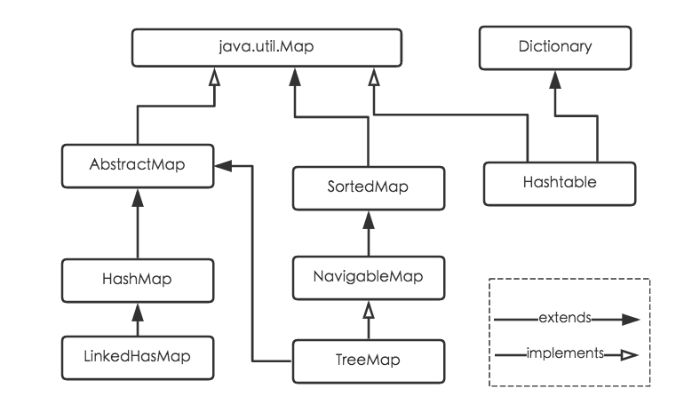

* 在Spring框架中,面向方面编程(AOP)的目标在于:将程序中涉及的公用问题集中解决
* 工厂模式、单例模式、反射机制、代理模式的作用
  * 工厂模式用来解决对象的创建类型问题.
  * 单例模式用来解决创建的对象数量问题
  * 反射就是在运行时获取当前运行的类或者对象的信息
  * 代理模式用来实现核心代码与非核心代码的解耦问题
  
* Spring支持的事务有两种：
  * `编程式事务`, 也就是在代码中手动声明事务开始、提交、回滚. 这种方式代码量大冗余度高
  * Spring还支持通过XML或者注解的声明式事务. 这种方式符合非侵入式的概念, 也是Spring推荐的方式
  
* Hibernate中的SessionFactory: 是用来创建Session的工厂, 本身是线程安全的

* HTTP Code意义
  * "1" 开头的代表的是消息
  * "2" 开头的代表是成功
  * "3" 开头的代表是重定向信息
  * "4" 开头代表请求错误
  * "5" 开头代表服务器错误

* 默认情况下Filter与Interceptor都是在项目启动的时候实例化, 然后常驻内存.在项目关闭的时候才会被销毁，都是单例模式. 单例模式优点在于性能好. 例如在JEE的项目中. Filter、Interceptor、Listener、Controller、Service、Dao都应该设置为单例模式. 这也是为什么Spring MVC的性能好于Struts的原因. 其中很重要的一点就是Struts的Action是多例的

* 使用单例模式时要注意在Web并发访问时的线程安全问题

## HashMap底层实现原理



[更多](https://tech.meituan.com/2016/06/24/java-hashmap.html)

* jdk1.7 (数组+链表)
* jdk1.8(数组+链表+红黑树)
  * 数组索引位置上`链表链表长度>8`且`当前数组长度>64`时，链表转换为红黑树，反之则转换为链表
    * 为什么？红黑树可以提升查询效率，数组+链表方式查询到某索引时，需要遍历索引对应的链表中的元素，而红黑树查找到索引后，无需遍历整个红黑树，只需要使用折半查找的方式就能快速查找
  * jdk8初始化和扩容都是使用resize()方法，jdk7初始化用inflateTable()，扩容用resize()

* 原理

  * 初始容量：16

  * 负载因子：0.75

  * 扩容：`数组存放数据 > 当前容量*0.75时进行扩容`，扩容为：`当前容量*2`，扩容为2的幂次方，最大为2的30次方，为了减小hash碰撞。**`避免扩容`**：以下是Guava工具包中的避免扩容的代码：`(int)(n/0.75+1)`

    ```java
    static int capacity(int expectedSize) {
        if (expectedSize < 3) {
            checkNonnegative(expectedSize, "expectedSize");
            return expectedSize + 1;
        }
        if (expectedSize < Ints.MAX_POWER_OF_TWO) {
            // This is the calculation used in JDK8 to resize when a putAll
            // happens; it seems to be the most conservative calculation we
            // can make.  0.75 is the default load factor.
            return (int) ((float) expectedSize / 0.75F + 1.0F);
        }
        return Integer.MAX_VALUE; // any large value
    }
    
    
    //可以通过下面的方法查看扩容后的容量
    Map<String, String> map = Maps.newHashMapWithExpectedSize(13);
    Class<?> mapType = map.getClass();
    Method capacity = mapType.getDeclaredMethod("capacity");
    capacity.setAccessible(true);
    System.out.println("capacity :" + capacity.invoke(map));
    ```

  * hash冲突：`开放地址法`（`线性探测法`）和`链地址法`，HashMap采用了链地址法。链地址法，简单来说，就是数组加链表的结合。在每个数组元素上都一个链表结构，当数据被Hash后，得到数组下标，把数据放在对应下标元素的链表上。在插入时，同样把int先取模落桶，如果遇到冲突，则不采样HashMap的链地址法，而是用开放地址法（线性探测法）index＋1找下一个空桶，最后在keys[index]，values[index]中分别记录。在查找时也是先落桶，然后在key[index++]中逐个比较key。如果 K 的 hash 值在 HashMap 中不存在，则执行插入，若存在，则发生碰撞； ii.如果 K 的 hash 值在 HashMap 中存在，且它们两者 equals 返回 true，则更新键值对； iii. 如果 K 的 hash 值在 HashMap 中存在，且它们两者 equals 返回 false，则插入链表的尾部（尾插法）或者红黑树中（树的添加方式）。（JDK 1.7 之前使用头插法、JDK 1.8 使用尾插法）（注意：当碰撞导致链表大于 TREEIFY_THRESHOLD = 8 时，就把链表转换成红黑树） 获取对象时，将 K 传给 get() 方法

* 线程安全的Map

  * ConcurentHashMap
    * 分段锁

## JUC

[参考](https://www.cnblogs.com/fisherss/p/13191490.html)

[参考](https://github.com/FISHers6/CS-LogN)
