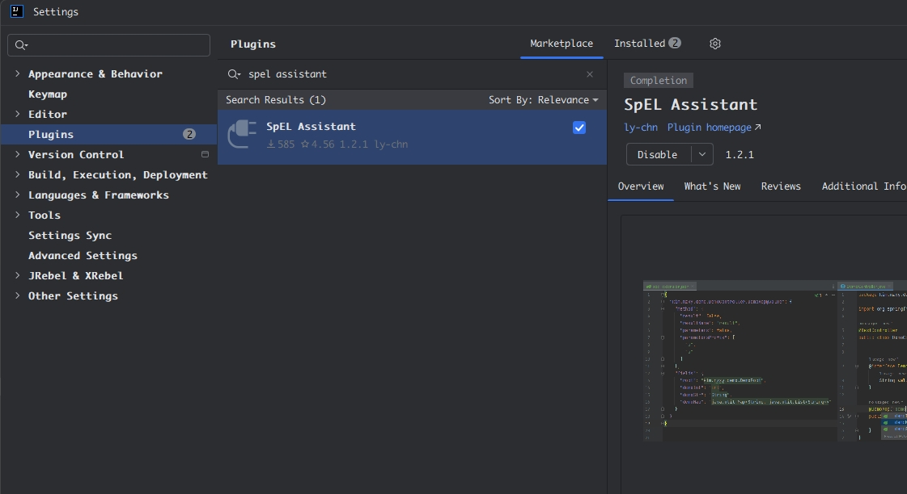
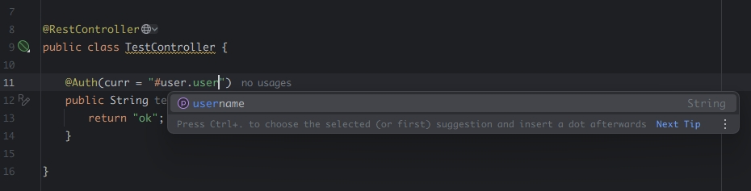

# IDEA中自定义java注解SpEL高丽跳转

### 安装插件spel assistant



### 项目src/main/resources创建spel-extension.json配置

> method.parameters设置为true，feilds.roo设置对应参数

```json
{
  "com.example.demo.ext.Auth@curr": {
    "prefix": "",
    "suffix": "",
    "method": {
      "result": false,
      "resultName": "result",
      "parameters": true,
      "parametersPrefix": [
        "p",
        "a"
      ]
    },
    "fields": {
      "root": "com.example.demo.domain.User"
    }
  }
}
```


### 自定义注解

```java
import java.lang.annotation.ElementType;
import java.lang.annotation.Retention;
import java.lang.annotation.RetentionPolicy;
import java.lang.annotation.Target;

@Target({ElementType.METHOD, ElementType.TYPE})
@Retention(RetentionPolicy.RUNTIME)
public @interface Auth {
    String curr();
}
```


### 使用示例

```java
@RestController
public class TestController {

    @Auth(curr = "#user.username")
    public String test(@RequestBody User user) {
        return "ok";
    }
}
```

>支持提示和跳转

