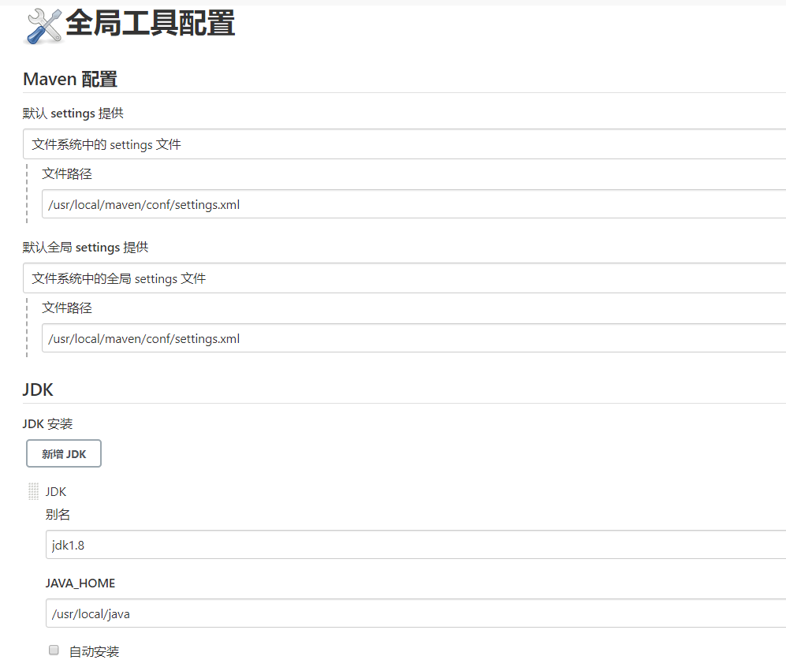
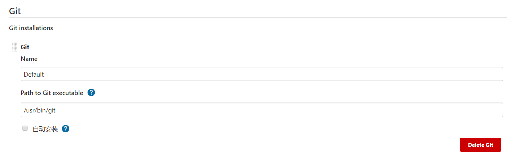
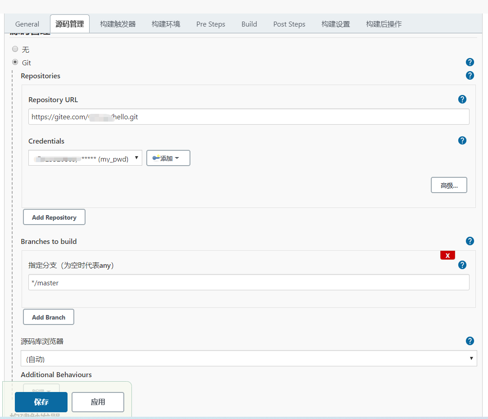
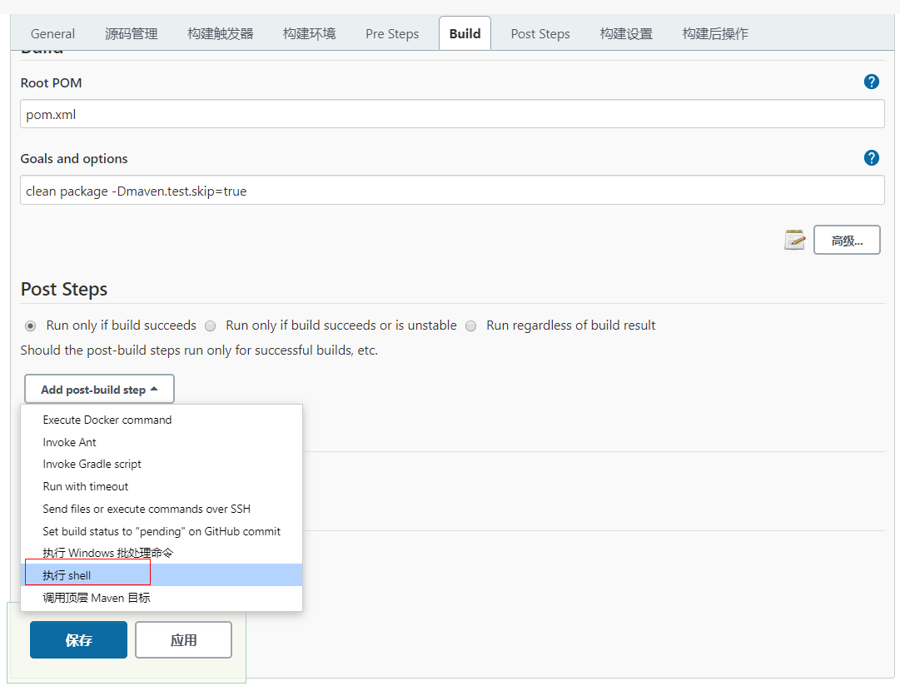

# docker Jenkins

[参考地址](https://www.cnblogs.com/zero666/p/12939355.html)

## 1.拉取镜像

```shell
docker pull jenkins/jenkins:lts
```

## 2.运行

```shell
# 创建jenkins目录
mkdir /data/jenkins

# 启动容器
docker run -d --name jenkins \
-u 0 \
-p 8088:8080 \
-e TZ=Asiz/Shanghai \
-v /data/jenkins:/var/jenkins_home \
-v /var/run/docker.sock:/var/run/docker.sock \
-v $(which docker):/usr/bin/docker \
-v /usr/local/jdk/jdk1.8.0_301:/usr/local/java \
-v /usr/local/env/maven3.6:/usr/local/maven \
jenkins/jenkins:lts

# 查看启动日志
docker logs jenkins

# docker方式安装需要先进入容器
docker exec -it jenkins bash

# 查看初始密码
cat /var/jenkins_home/secrets/initialAdminPassword

# 访问web管理端,第一次访问需要设置密码
# 用户：admin
localhost:8081
```

## 3.安装插件

> 系统管理>插件管理，安装完成后重启：http://ip:8081/restart，若安装插件错误，比如安装gitee错误，执行操作`rm -rf /var/jenkins_home/plugins/gitlab-hook.jpi /var/jenkins_home/plugins/ruby-runtime.jpi`

* Maven Integration
* Deploy to container
* docker-build-step
* Publish Over SSH

## 4.配置环境

> 配置maven、JDK、Git，系统管理>全局工具配置，这里的环境都必须是前面配置挂载的：-v配置的容器中的路径地址：/usr/local/java，不能用宿主机的路径





## 5.构建任务

### 5.1 创建maven项目

### 5.2配置git



### 5.3 配置构建maven打包

> clean package -Dmaven.test.skip=true

### 5.4 构建后发布



* shell命令

#### 单次构建

```shell
docker build -f Dockerfile -t hello:v1.0 .
docker run -d -p 8089:8090 --name test_2021 test:v1.0
```

#### 多次构建

> 每次构建运行前先停止容器、删除容器，然后再删除镜像

```shell
#!/bin/bash
# 容器名称
DOCKERNAME='test'
# 版本tag信息
REPOSITORIES='test'
current=`date "+%Y-%m-%d %H:%M:%S"`
timeStamp=`date -d "$current" +%s` 
currentTimeStamp=$((timeStamp*1000+10#`date "+%N"`/1000000))
TAG="v$currentTimeStamp"

# 删除原来的容器
CONTAINER_ID=`docker ps | grep "${DOCKERNAME}" | awk '{print $1}'`
if [ -n "$CONTAINER_ID" ]; then
	echo "stop $CONTAINER_ID ..."
    docker stop $CONTAINER_ID
    docker rm $CONTAINER_ID
    echo "delete container: $CONTAINER_ID ..."
else # 启动失败，删除
    CONTAINER_ID=`docker ps -a | grep -w $REPOSITORIES | awk '{print $1}'`
    if [ -n "$CONTAINER_ID" ]; then
    	echo "run failed, delete container: $CONTAINER_ID ..."
        docker rm $CONTAINER_ID
    fi
fi

# 删除原来的镜像
IMAGE_ID=`docker images | grep -w $REPOSITORIES | awk '{print $3}'`
echo "delete image $IMAGE_ID ..."
if [ -n "${IMAGE_ID}" ];then
    docker rmi ${IMAGE_ID}
    echo "delete image $IMAGE_ID"
fi

docker build -f Dockerfile -t ${REPOSITORIES}:${TAG} .
docker run -itd --name=${DOCKERNAME} -p 8089:8090 ${REPOSITORIES}:${TAG}
```

### 5.5 立即构建

> 点击立即构建开始构建项目

## 6.WebHook

> 安装插件：`Generic Webhook Trigger`，安装好插件后重启jenkins, 在对应的任务配置中勾选上，需要公网能访问的ip才能使用，如果是虚拟机无法被公网访问则无法触发


## 注意

### Dockerfile

```shell
FROM openjdk:8-jdk-alpine
ENV TZ=Asia/Shanghai
RUN ln -snf /usr/share/zoneinfo/$TZ /etc/localtime && echo $TZ > /etc/timezone
COPY target/hello-1.0.jar /home/app.jar
ENTRYPOINT [ "java","-jar", "app.jar" ]
```

