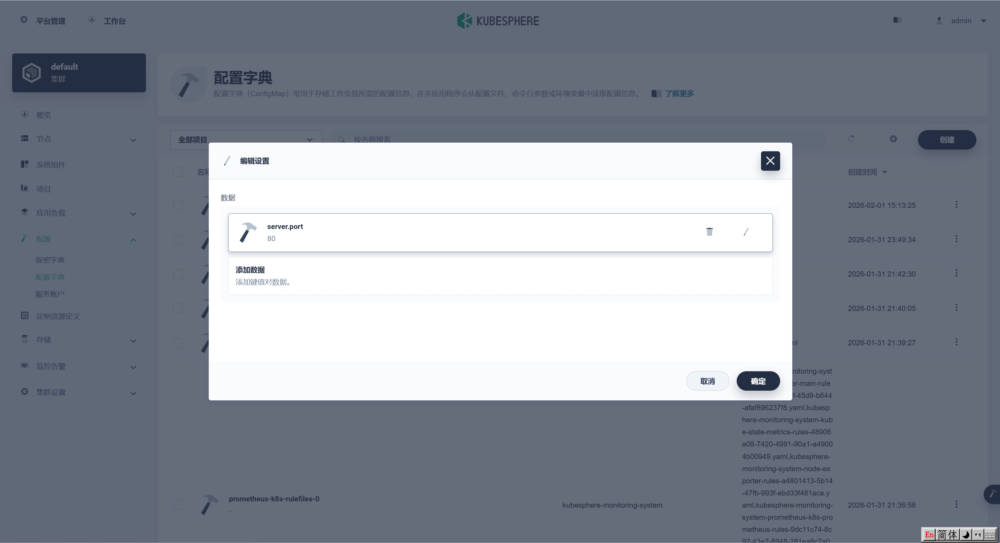
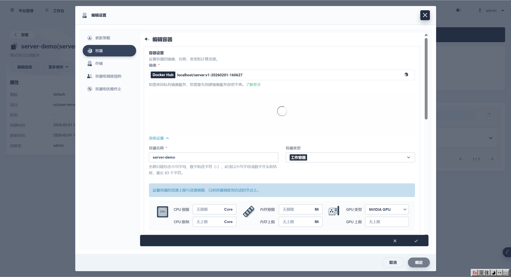
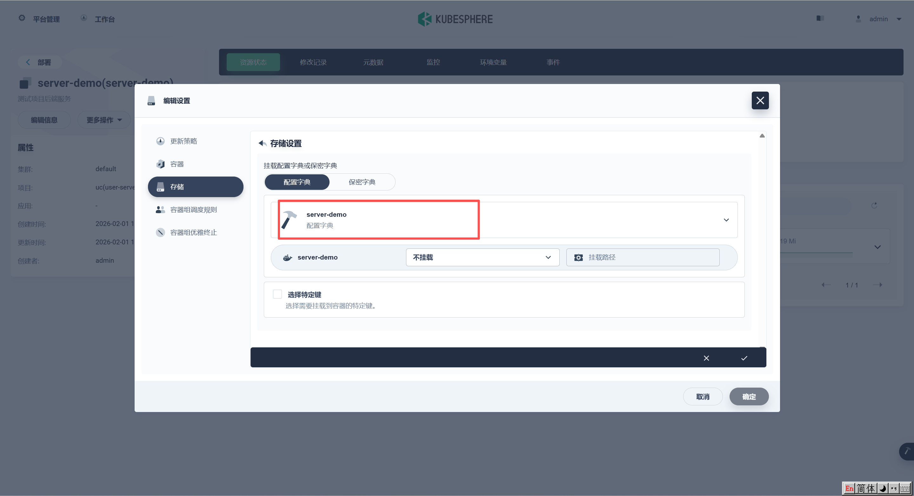
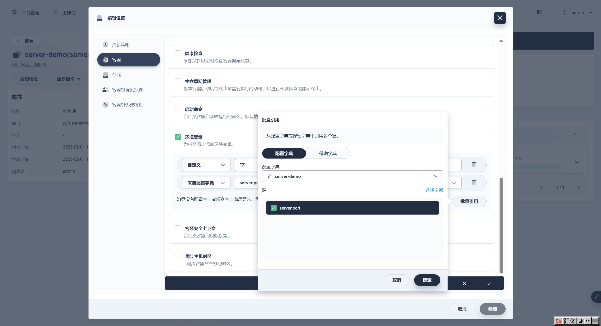
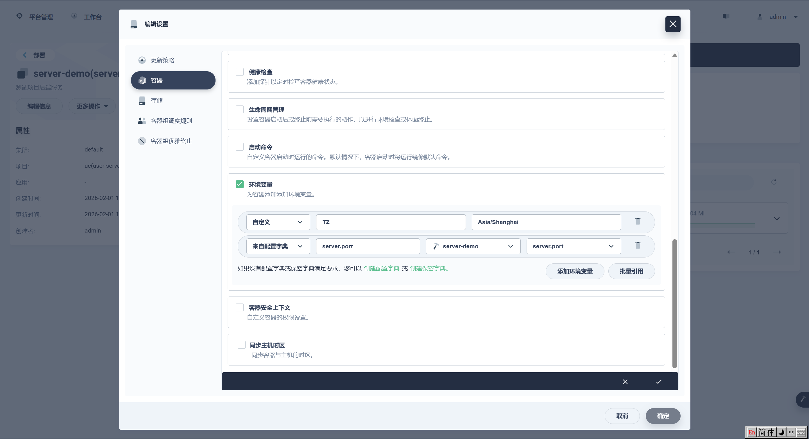
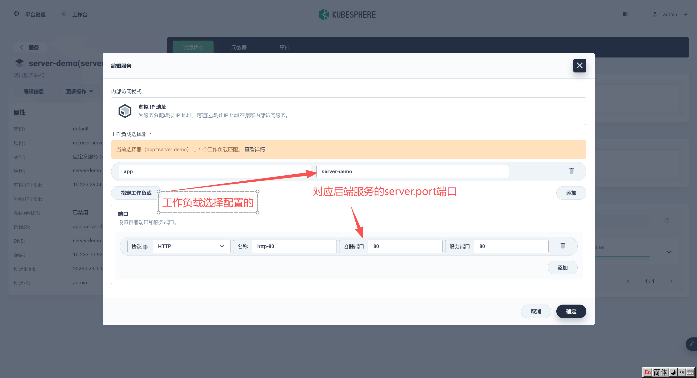
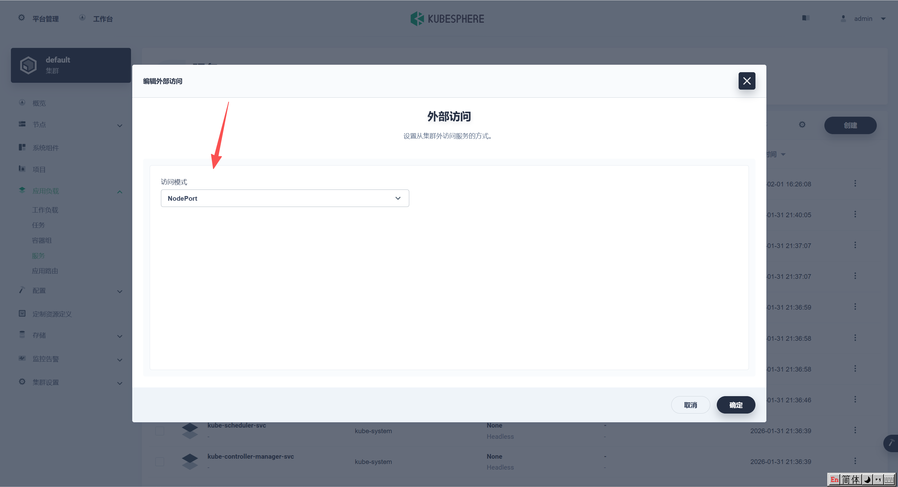
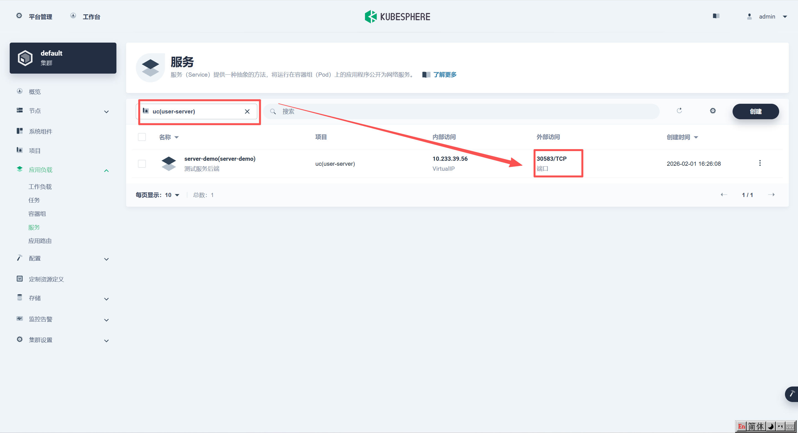
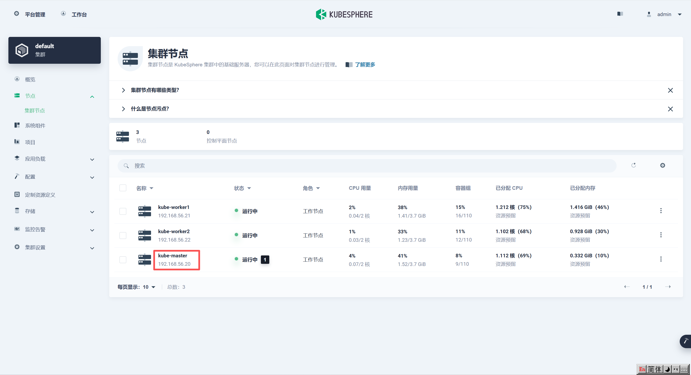
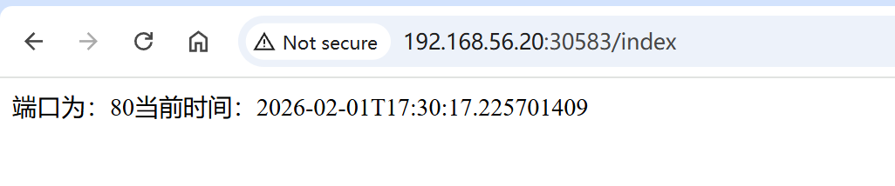

# KubeSphere部署java

> k8s 1.24+默认用的Containerd，需配合buildkit和nerdctl 构建镜像，nerdctl安全兼容docker和Dockerfile命令

## 1.安装buildkit

### 1.1 下载解压

```sh
wget https://github.com/moby/buildkit/releases/download/v0.27.1/buildkit-v0.27.1.linux-amd64.tar.gz

tar -zxvf buildkit-v0.27.1.linux-amd64.tar.gz -C /usr/local
```

### 2.2 配置服务

```sh
vim /lib/systemd/system/buildkit.socket
#cat /lib/systemd/system/buildkit.socket
#######################################
[Unit]
Description=BuildKit
Documentation=https://github.com/moby/buildkit

[Socket]
ListenStream=%t/buildkit/buildkitd.sock
SocketMode=0660

[Install]
WantedBy=sockets.target

vim /lib/systemd/system/buildkit.service
#cat /lib/systemd/system/buildkit.service
#########################################
[Unit]
Description=BuildKit
Requires=buildkit.socket
After=buildkit.socket
Documentation=https://github.com/moby/buildkit

[Service]
ExecStart=/usr/local/bin/buildkitd --oci-worker=false --containerd-worker=true

[Install]
WantedBy=multi-user.target
```

### 2.3 启动服务

```sh
systemctl enable buildkit.service
systemctl start buildkit.service
```

## 2.安装nerdctl 

### 2.1 下载解压

```sh
# 安装 nerdctl 
wget https://github.com/containerd/nerdctl/releases/download/v2.2.1/nerdctl-2.2.1-linux-amd64.tar.gz
# 解压
tar -zxvf nerdctl-2.2.1-linux-amd64.tar.gz -C /usr/local/bin
```

### 2.2 自动补全

```sh
# 配置自动补全
echo 'source <(nerdctl completion bash)' >> /etc/profile
source /etc/profile
```


## 3.配置containerd镜像库

### 3.1 写入配置

```sh
mkdir -p /etc/containerd/ext_mirrors/docker.io
cat > /etc/containerd/ext_mirrors/docker.io/hosts.toml << 'EOF'
server = "https://docker.io"
#server = "https://registry-1.docker.io"
#[host."https://docker.io"]
 # capabilities = ["pull", "resolve"]

[host."https://docker.1ms.run"]
  capabilities = ["pull", "resolve"]

[host."https://proxy.1panel.live"]
  capabilities = ["pull", "resolve"]

[host."https://docker.xuanyuan.me"]
  capabilities = ["pull", "resolve"]

[host."https://hub.geekery.cn"]
  capabilities = ["pull", "resolve"]

[host."https://docker.m.daocloud.io"]
  capabilities = ["pull", "resolve"]

[host."https://docker.rainbond.cc"]
  capabilities = ["pull", "resolve"]

EOF
```

### 3.2 编辑配置

> /etc/containerd/config.toml

```yaml
# /etc/containerd/config.toml
[plugins."io.containerd.grpc.v1.cri".registry]
  config_path = "/etc/containerd/ext_mirrors"
```

- 在 containerd 2.x 中

```yaml
version = 3

[plugins."io.containerd.cri.v1.images".registry]
   config_path = "/etc/containerd/ext_mirrors"
```

- 在 containerd 1.x 中

```yaml
version = 2

[plugins."io.containerd.grpc.v1.cri".registry]
   config_path = "/etc/containerd/ext_mirrors"
```

## 3.拉取镜像

```sh
# 方式1 可以使用containerd加速镜像
crictl pull nginx

# 方式2 无法使用加速镜像，只能指定镜像源+镜像才能拉取
nerdctl pull docker.1ms.run/nginx
nerdctl tag docker.1ms.run/nginx:latest nginx:latest
```

## 4.构建镜像

### 4.1 Dockerfile

```dockerfile
FROM docker.1ms.run/library/openjdk:17-ea-17-slim
WORKDIR /app
COPY springboot3-deploy-demo-0.0.1-SNAPSHOT.jar /app/app.jar
EXPOSE 8080
ENTRYPOINT ["java", "-jar", "/app/app.jar"]
```

### 4.2 构建镜像

```sh
# 方式1 构建镜像
nerdctl --namespace k8s.io build -t localhost/server:v1 .
# 查看镜像
nerdctl -n k8s.io images

# 方式2 （推荐）
# 在master节点编辑脚本
vim build.sh
chmod +x build.sh

#!/bin/bash
set -e

# 镜像信息
IMAGE_NAME="localhost/server"
IMAGE_TAG="v1"
NAMESPACE="k8s.io"

# 时间戳（可选）
TIMESTAMP=$(date +%Y%m%d-%H%M%S)
FULL_IMAGE="${IMAGE_NAME}:${IMAGE_TAG}-${TIMESTAMP}"
TAR_FILE="/tmp/server_${TIMESTAMP}.tar"

# 工作节点列表
WORKERS=("kube-worker1" "kube-worker2")

echo "=============================="
echo "1. 构建镜像: $FULL_IMAGE"
echo "=============================="

nerdctl --namespace $NAMESPACE build -t $FULL_IMAGE .

echo "=============================="
echo "2. 保存镜像为 tar: $TAR_FILE"
echo "=============================="

nerdctl --namespace $NAMESPACE save -o $TAR_FILE $FULL_IMAGE

# 复制并用 ctr 导入
for NODE in "${WORKERS[@]}"; do
  echo "=============================="
  echo "3. 复制并导入镜像到 $NODE"
  echo "=============================="
  
  scp $TAR_FILE ${NODE}:${TAR_FILE}
  
  ssh $NODE "sudo ctr -n k8s.io images import ${TAR_FILE} && rm -f ${TAR_FILE}"
done

echo "=============================="
echo "✅ 镜像同步完成，所有节点 containerd 已加载镜像 $FULL_IMAGE"
echo "=============================="

```

## 5.部署

### 5.1 创建配置

> 主要是需要动态加载的配置可以在这里配置



### 5.2 构建pod

#### 5.2.1 创建pod配置

> 应用负载》工作负载》部署》创建》容器



#### 5.3.2 存储

> 存储》配置字典》选择前面配置的字典



#### 5.3.3 环境变量

> 环境变量》批量引用》配置字典》选择配置的server-demo



> 引入配置，这里就是加载`-Dserver.port=80`这种动态配置，项目也可以定义如：`ALIPAY_GATEWAY`这种，好处是环境不通，无论项目jar里面的配置怎么改，都会以这里的为准，不会说项目配置变了又得重新打包部署



## 6.服务

### 6.1 新建服务

> 选择虚拟ip地址，指定工作负载选择配置的"server-demo"，端口根据实际配置修改，这里的端口可以严格按照不同服务的来，好区分，比如mqtt-1883,nginx-80,mysql-330这种，真正暴露是在服务配置暴露的



### 6.2 外部访问

> 外部访问配置为“NodePort”



## 7.访问测试

### 7.1 查看暴露端口



### 7.2 查看master



### 7.3 访问

> 访问地址为：master节点IP:服务暴露IP，我这里是：http://192.168.56.20:30583



## 疑问

### 1.不同端口的含义

```sh
# 8080服务对应pod内部端口
containers:
  - name: app
    image: myapp
    ports:
      - containerPort: 8080
---
spec:
  type: NodePort
  ports:
    - port: 80         # 集群内访问Service时用80
      targetPort: 8080 # Pod实际监听的端口
      nodePort: 30583  # 外部访问节点IP:30583
```

