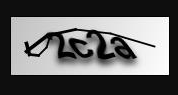

# Kaptcha验证码

## 1.pom依赖

```xml
<dependency>
    <groupId>com.github.penggle</groupId>
    <artifactId>kaptcha</artifactId>
    <version>2.3.2</version>
</dependency>
```

## 2.配置bean

> `数字+英文字母验证`和`基本运算验证`

```java
package com.example.captchdemo.config;

import com.google.code.kaptcha.impl.DefaultKaptcha;
import com.google.code.kaptcha.impl.NoNoise;
import com.google.code.kaptcha.impl.ShadowGimpy;
import com.google.code.kaptcha.util.Config;
import org.springframework.context.annotation.Bean;
import org.springframework.context.annotation.Configuration;
import org.springframework.context.annotation.Primary;

import java.util.Properties;

import static com.google.code.kaptcha.Constants.*;

@Configuration
public class KaptchaConfig {

    /**
     * 基础版【数字+字母】
     */
    @Bean(name = "captchaProducer")
    public DefaultKaptcha getKaptchaBean() {
        DefaultKaptcha defaultKaptcha = new DefaultKaptcha();
        Properties properties = new Properties();
        // 是否有边框 默认为true 我们可以自己设置yes，no
        properties.setProperty(KAPTCHA_BORDER, "yes");
        // 验证码文本字符颜色 默认为Color.BLACK
        properties.setProperty(KAPTCHA_TEXTPRODUCER_FONT_COLOR, "black");
        // 验证码图片宽度 默认为200
        properties.setProperty(KAPTCHA_IMAGE_WIDTH, "160");
        // 验证码图片高度 默认为50
        properties.setProperty(KAPTCHA_IMAGE_HEIGHT, "60");
        // 验证码文本字符大小 默认为40
        properties.setProperty(KAPTCHA_TEXTPRODUCER_FONT_SIZE, "38");
        // KAPTCHA_SESSION_KEY
        properties.setProperty(KAPTCHA_SESSION_CONFIG_KEY, "kaptchaCode");
        // 验证码文本字符长度 默认为5
        properties.setProperty(KAPTCHA_TEXTPRODUCER_CHAR_LENGTH, "4");
        // 验证码文本字体样式 默认为new Font("Arial", 1, fontSize), new Font("Courier", 1, fontSize)
        properties.setProperty(KAPTCHA_TEXTPRODUCER_FONT_NAMES, "Arial,Courier");
        // 图片样式 水纹com.google.code.kaptcha.impl.WaterRipple 鱼眼com.google.code.kaptcha.impl.FishEyeGimpy 阴影com.google.code.kaptcha.impl.ShadowGimpy
        properties.setProperty(KAPTCHA_OBSCURIFICATOR_IMPL, ShadowGimpy.class.getName());
        defaultKaptcha.setConfig(new Config(properties));
        return defaultKaptcha;
    }

    /**
     * 增强版【加减乘除运运算】
     */
    @Bean(name = "captchaProducerMath")
    public DefaultKaptcha getKaptchaBeanMath() {
        DefaultKaptcha defaultKaptcha = new DefaultKaptcha();
        Properties properties = new Properties();
        // 是否有边框 默认为true 我们可以自己设置yes，no
        properties.setProperty(KAPTCHA_BORDER, "yes");
        // 边框颜色 默认为Color.BLACK
        properties.setProperty(KAPTCHA_BORDER_COLOR, "105,179,90");
        // 验证码文本字符颜色 默认为Color.BLACK
        properties.setProperty(KAPTCHA_TEXTPRODUCER_FONT_COLOR, "18,150,100");
        //properties.setProperty(KAPTCHA_TEXTPRODUCER_FONT_COLOR, "blue");
        // 验证码图片宽度 默认为200
        properties.setProperty(KAPTCHA_IMAGE_WIDTH, "160");
        // 验证码图片高度 默认为50
        properties.setProperty(KAPTCHA_IMAGE_HEIGHT, "60");
        // 验证码文本字符大小 默认为40
        properties.setProperty(KAPTCHA_TEXTPRODUCER_FONT_SIZE, "35");
        // KAPTCHA_SESSION_KEY
        properties.setProperty(KAPTCHA_SESSION_CONFIG_KEY, "kaptchaCodeMath");
        // 验证码文本生成器
        properties.setProperty(KAPTCHA_TEXTPRODUCER_IMPL, KaptchaTextCreator.class.getName());
        // 验证码文本字符间距 默认为2
        properties.setProperty(KAPTCHA_TEXTPRODUCER_CHAR_SPACE, "3");
        // 验证码文本字符长度 默认为5
        properties.setProperty(KAPTCHA_TEXTPRODUCER_CHAR_LENGTH, "6");
        // 验证码文本字体样式 默认为new Font("Arial", 1, fontSize), new Font("Courier", 1, fontSize)
        properties.setProperty(KAPTCHA_TEXTPRODUCER_FONT_NAMES, "Arial,Courier");
        // 验证码噪点颜色 默认为Color.BLACK
        properties.setProperty(KAPTCHA_NOISE_COLOR, "white");
        // 干扰实现类
        properties.setProperty(KAPTCHA_NOISE_IMPL, NoNoise.class.getName());
        // 图片样式 水纹com.google.code.kaptcha.impl.WaterRipple 鱼眼com.google.code.kaptcha.impl.FishEyeGimpy 阴影com.google.code.kaptcha.impl.ShadowGimpy
        properties.setProperty(KAPTCHA_OBSCURIFICATOR_IMPL, ShadowGimpy.class.getName());
        defaultKaptcha.setConfig(new Config(properties));
        return defaultKaptcha;
    }
}
```

## 3.扩展自定义验证生成器

> 自定义验证码规则

```java
package com.example.captchdemo.config;

import com.google.code.kaptcha.text.impl.DefaultTextCreator;

import java.security.SecureRandom;
import java.util.Random;

public class KaptchaTextCreator extends DefaultTextCreator {

    private static final String[] NUMS = {"0", "1", "2", "3", "4", "5", "6", "7", "8", "9", "10"};

    @Override
    public String getText() {
        Integer result = 0;
        Random random = new SecureRandom();
        int x = random.nextInt(10);
        int y = random.nextInt(10);
        StringBuilder suChinese = new StringBuilder();
        int randomNumber = (int) Math.round(Math.random() * 2);
        if (randomNumber == 0) {
            result = x * y;
            suChinese.append(NUMS[x]);
            suChinese.append("*");
            suChinese.append(NUMS[y]);
        } else if (randomNumber == 1) {
            if (!(x == 0) && y % x == 0) {
                result = y / x;
                suChinese.append(NUMS[y]);
                suChinese.append("/");
                suChinese.append(NUMS[x]);
            } else {
                result = x + y;
                suChinese.append(NUMS[x]);
                suChinese.append("+");
                suChinese.append(NUMS[y]);
            }
        } else if (randomNumber == 2) {
            if (x >= y) {
                result = x - y;
                suChinese.append(NUMS[x]);
                suChinese.append("-");
                suChinese.append(NUMS[y]);
            } else {
                result = y - x;
                suChinese.append(NUMS[y]);
                suChinese.append("-");
                suChinese.append(NUMS[x]);
            }
        } else {
            result = x + y;
            suChinese.append(NUMS[x]);
            suChinese.append("+");
            suChinese.append(NUMS[y]);
        }
        suChinese.append("=?@" + result);
        return suChinese.toString();
    }
}
```

## 4.调用方式

### 4.1基础版调用

```java
package com.example.captchdemo.controller;

import com.google.code.kaptcha.Constants;
import com.google.code.kaptcha.Producer;
import org.springframework.stereotype.Controller;
import org.springframework.web.bind.annotation.GetMapping;

import javax.annotation.Resource;
import javax.imageio.ImageIO;
import javax.servlet.ServletOutputStream;
import javax.servlet.http.HttpServletRequest;
import javax.servlet.http.HttpServletResponse;
import java.awt.image.BufferedImage;
import java.io.IOException;

@Controller
public class kaptchaController {

    @Resource
    private Producer captchaProducer;

    @GetMapping("verification")
    public void verification(HttpServletRequest request, HttpServletResponse response) throws IOException {
        response.setDateHeader("Expires", 0);
        // Set standard HTTP/1.1 no-cache headers.
        response.setHeader("Cache-Control", "no-store, no-cache, must-revalidate");
        // Set IE extended HTTP/1.1 no-cache headers (use addHeader).
        response.addHeader("Cache-Control", "post-check=0, pre-check=0");
        // Set standard HTTP/1.0 no-cache header.
        response.setHeader("Pragma", "no-cache");
        // return a jpeg
        response.setContentType("image/jpeg");
        // create the text for the image
        String capText = captchaProducer.createText();
        // store the text in the session
        request.getSession().setAttribute(Constants.KAPTCHA_SESSION_KEY, capText);
        // create the image with the text
        BufferedImage bi = captchaProducer.createImage(capText);
        try (ServletOutputStream out = response.getOutputStream()) {
            // write the data out
            ImageIO.write(bi, "jpg", out);
            out.flush();
        }
    }
}
```

> 效果图



### 4.2增强版【自定义版本】

```java
package com.example.captchdemo.controller;

import com.google.code.kaptcha.Constants;
import com.google.code.kaptcha.Producer;
import org.springframework.stereotype.Controller;
import org.springframework.web.bind.annotation.GetMapping;

import javax.annotation.Resource;
import javax.imageio.ImageIO;
import javax.servlet.ServletOutputStream;
import javax.servlet.http.HttpServletRequest;
import javax.servlet.http.HttpServletResponse;
import java.awt.image.BufferedImage;
import java.io.IOException;

@Controller
public class kaptchaController {

    @Resource(name = "captchaProducerMath")
    private Producer captchaProducer;

    @GetMapping("verification")
    public void verification(HttpServletRequest request, HttpServletResponse response) throws IOException {
        response.setDateHeader("Expires", 0);
        // Set standard HTTP/1.1 no-cache headers.
        response.setHeader("Cache-Control", "no-store, no-cache, must-revalidate");
        // Set IE extended HTTP/1.1 no-cache headers (use addHeader).
        response.addHeader("Cache-Control", "post-check=0, pre-check=0");
        // Set standard HTTP/1.0 no-cache header.
        response.setHeader("Pragma", "no-cache");
        // return a jpeg
        response.setContentType("image/jpeg");
        // create the text for the image
        String capText = captchaProducer.createText();
        String[] split = capText.split("@");
        String calcText = split[0];
        String result = split[1];
        // store the text in the session
        request.getSession().setAttribute(Constants.KAPTCHA_SESSION_KEY, result);
        // create the image with the text
        BufferedImage bi = captchaProducer.createImage(calcText);
        try (ServletOutputStream out = response.getOutputStream()) {
            // write the data out
            ImageIO.write(bi, "jpg", out);
            out.flush();
        }
    }
}
```

> 效果图

