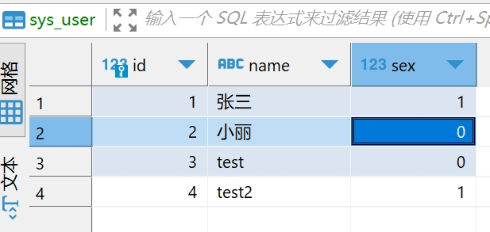
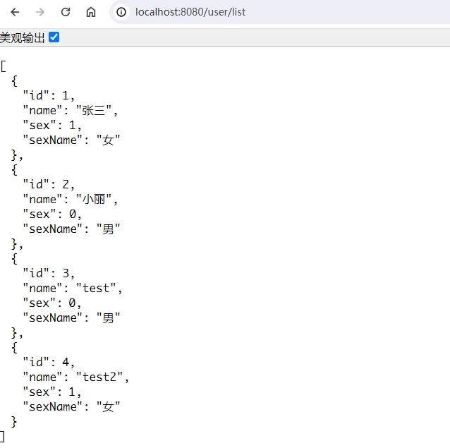

## mybatisplus枚举

> 通常在项目中枚举类存储的是code，但是数据回显时想要展示对应的中文状态

### 1.通用接口

```java
package org.example.enums.base;

/**
 * 枚举类通用接口
 *
 * @param <T> 枚举value对应类型：Integer、String等
 * @param <S> 枚举name对应的类型
 */
public interface BaseEnum<T, S> {

    T getCode();

    S getName();
}
```


### 2.业务具体实现

```java
package org.example.enums;


import com.baomidou.mybatisplus.annotation.EnumValue;
import com.fasterxml.jackson.annotation.JsonValue;
import org.example.enums.base.BaseEnum;

public enum Sex implements BaseEnum<Integer, String> {

    MAN(0, "男"),
    WOMAN(1, "女");

    @JsonValue
    @EnumValue
    private final Integer code;

    private final String name;

    Sex(Integer code, String name) {
        this.code = code;
        this.name = name;
    }

    @Override
    public Integer getCode() {
        return code;
    }

    @Override
    public String getName() {
        return name;
    }
}
```

### 3.实体类（领域类）

> 这里通过定义一个枚举对应的name属性，重写getter方法实现，如：`getSexName()`

```java
package org.example.domain.entity;

import com.baomidou.mybatisplus.annotation.IdType;
import com.baomidou.mybatisplus.annotation.TableField;
import com.baomidou.mybatisplus.annotation.TableId;
import com.baomidou.mybatisplus.annotation.TableName;
import lombok.AllArgsConstructor;
import lombok.Builder;
import lombok.Data;
import lombok.NoArgsConstructor;
import org.example.enums.Sex;
import org.example.enums.base.BaseEnum;

import java.util.Optional;

@Data
@Builder
@NoArgsConstructor
@AllArgsConstructor
@TableName("sys_user")
public class SysUser {

    @TableId(type = IdType.AUTO)
    private Long id;

    private String name;

    private Sex sex;

    @TableField(exist = false)
    private String sexName;

    public String getSexName() {
        return Optional.ofNullable(sex).map(BaseEnum::getName).orElse(null);
    }
}
```


### 4.效果

* 表数据



* 接口返回数据

