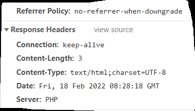

## nginx自定义server

> [参考](https://blog.csdn.net/qq_26312651/article/details/88356345)



### springboot

> springboot可以自定义server

* yaml

```yaml
server:
  server-header: PHP
```

### nginx

> nginx代理后，想直接获取上面配置的server

```nginx
http {
	
	#隐藏nginx版本号
    #server_tokens off;

    server {
    
        listen       80;
        server_name  localhost;
        charset utf-8;

        location / {
            proxy_pass http://127.0.0.1:8080;
			proxy_http_version 1.1;
			proxy_set_header Host $host;
			proxy_set_header X-Real-IP $remote_addr;
			proxy_set_header X-Forwarded-For $proxy_add_x_forwarded_for;
			proxy_set_header X-Forwarded-Proto $scheme;
			proxy_set_header X-Forwarded-Port $server_port;
			proxy_set_header Upgrade $http_upgrade;
			proxy_set_header Connection "upgrade";

			# 传递上层的Server
			proxy_pass_header Server;
			
			# 添加header
			#add_header Server 'PHP/1.0.0';
        }
}
```

