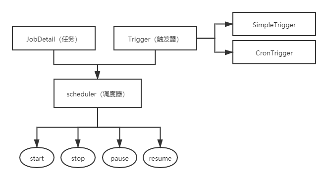

# 1. Quartz实战应用

## 一、核心概念

* 任务`Job`
  
* 触发器`Trigger`
  * `SimpleTrigger`
  * `CronTrigger`

* 调度器`Scheduler`
  
  * 将任务`Job`和触发器`Trigger`整合起来，基于`Trigger`设定的时间执行`Job`
  

> 每个`Job`必须实现`org.quartz.Job`接口，且只需实现接口定义的`execute`方法

## 二、结构




### CoreTrigger(核心触发器)

- CalendarIntervalTriggerImpl
- CronTriggerImpl
- DailTimeIntervalTriggerImpl
- SimpleTriggerImpl

## 三、实现方式

#### 1.实现`Job`接口

#### 2.继承`QuartzJobBean`类

* 由于Spring提供对Quartz的支持，所以直接使用Spring提供的API，继承org.springframework.scheduling.quartz.QuartzJobBean

## 四、Scheduler(调度器)

| 暂停任务     | Scheduler scheduler = schedulerFactoryBean.getScheduler(); <br/>JobKey jobKey = JobKey.jobKey(scheduleJob.getJobName(), scheduleJob.getJobGroup()); scheduler.pauseJob(jobKey); |
| ------------ | ------------------------------------------------------------ |
| 恢复任务     | Scheduler scheduler = schedulerFactoryBean.getScheduler(); <br/>JobKey jobKey = JobKey.jobKey(scheduleJob.getJobName(), scheduleJob.getJobGroup()); scheduler.resumeJob(jobKey); |
| 删除任务     | Scheduler scheduler = schedulerFactoryBean.getScheduler(); <br/>JobKey jobKey = JobKey.jobKey(scheduleJob.getJobName(), scheduleJob.getJobGroup()); scheduler.deleteJob(jobKey); |
| 立即运行任务 | Scheduler scheduler = schedulerFactoryBean.getScheduler(); <br/>JobKey jobKey = JobKey.jobKey(scheduleJob.getJobName(), scheduleJob.getJobGroup()); scheduler.triggerJob(jobKey); |


## 五、misfire(失火/哑火)

> 错过的，指本来应该被执行但实际没有被执行的任务调度

**产生条件**：

* 到了该触发执行时上一个执行还未完成，且线程池中没有空闲线程可以使用（或有空闲线程可以使用但job设置为`@DisallowConcurrentExecution`）且过期时间已经超过misfireThreshold就认为是misfire了，错失触发了job默认是并发执行, 如果job设置`@DisallowConcurrentExecution` ,则为串行执行.
  

**产生原因**：

* 系统因为某些原因被重启。在系统关闭到重新启动之间的一段时间里，可能有些任务会被 misfire；
* Trigger 被暂停（suspend）的一段时间里，有些任务可能会被 misfire；
* 线程池中所有线程都被占用，导致任务无法被触发执行，造成 misfire；
* 有状态任务在下次触发时间到达时，上次执行还没有结束；为了处理 misfired job，Quartz 中为 trigger 定义了处理策略，主要有下面两种：MISFIRE_INSTRUCTION_FIRE_ONCE_NOW：针对 misfired job 马上执行一次；MISFIRE_INSTRUCTION_DO_NOTHING：忽略 misfired job，等待下次触发；默认是MISFIRE_INSTRUCTION_SMART_POLICY，该策略在CronTrigger中=MISFIRE_INSTRUCTION_FIRE_ONCE_NOW线程默认1分钟执行一次；在一个事务中，默认一次最多recovery 20个；

### 1.SimpleTrigger

> 默认为 `Trigger.MISFIRE_INSTRUCTION_SMART_POLICY` - 以当前时间为触发频率立即触发执行，也就是withMisfireHandlingInstructionFireNow()

```java
// api
withMisfireHandlingInstructionFireNow()
withMisfireHandlingInstructionIgnoreMisfires()
withMisfireHandlingInstructionNextWithExistingCount()
withMisfireHandlingInstructionNextWithRemainingCount()
withMisfireHandlingInstructionNowWithExistingCount()
withMisfireHandlingInstructionNowWithRemainingCount()
```

#### 处理机制

* 1.`withMisfireHandlingInstructionFireNow`  ---> misfireInstruction == 1
  * 以当前时间为触发频率立即触发执行
  * 执行至FinalTIme的剩余周期次数
  * 以调度或恢复调度的时刻为基准的周期频率，FinalTime根据剩余次数和当前时间计算得到
  * 调整后的FinalTime会略大于根据starttime计算的到的FinalTime值

* 2.`withMisfireHandlingInstructionIgnoreMisfires` ---> misfireInstruction == -1
  * 以错过的第一个频率时间立刻开始执行
  * 重做错过的所有频率周期
  * 当下一次触发频率发生时间大于当前时间以后，按照Interval的依次执行剩下的频率
    共执行RepeatCount+1次

* 3.`withMisfireHandlingInstructionNextWithExistingCount` ---> misfireInstruction == 5
  * 不触发立即执行
  * 等待下次触发频率周期时刻，执行至FinalTime的剩余周期次数
  * 以startTime为基准计算周期频率，并得到FinalTime
  * 即使中间出现pause，resume以后保持FinalTime时间不变

* 4.`withMisfireHandlingInstructionNextWithRemainingCount` ---> misfireInstruction = 4
  * 不触发立即执行
  * 等待下次触发频率周期时刻，执行至FinalTime的剩余周期次数
  * 以startTime为基准计算周期频率，并得到FinalTime
  * 即使中间出现pause，resume以后保持FinalTime时间不变

* 5.`withMisfireHandlingInstructionNowWithExistingCount` ---> misfireInstruction = 2
  * 以当前时间为触发频率立即触发执行
  * 执行至FinalTIme的剩余周期次数
  * 以调度或恢复调度的时刻为基准的周期频率，FinalTime根据剩余次数和当前时间计算得到
  * 调整后的FinalTime会略大于根据starttime计算的到的FinalTime值

* 6.`withMisfireHandlingInstructionNowWithRemainingCount` --- >misfireInstruction = 3
  * 以当前时间为触发频率立即触发执行
  * 执行至FinalTIme的剩余周期次数
  * 以调度或恢复调度的时刻为基准的周期频率，FinalTime根据剩余次数和当前时间计算得到
  * 调整后的FinalTime会略大于根据starttime计算的到的FinalTime值
* `MISFIRE_INSTRUCTION_RESCHEDULE_NOW_WITH_REMAINING_REPEAT_COUNT`值为 3
    * 此指令导致trigger忘记原始设置的starttime和repeat-count
    * 触发器的repeat-count将被设置为剩余的次数
    * 这样会导致后面无法获得原始设定的starttime和repeat-count值


### 2.CronTrigger

> 默认为 `Trigger.MISFIRE_INSTRUCTION_SMART_POLICY` - 以当前时间为触发频率立即触发执行，也就是withMisfireHandlingInstructionFireNow()

```java
// api
withMisfireHandlingInstructionDoNothing()
withMisfireHandlingInstructionFireAndProceed()
withMisfireHandlingInstructionIgnoreMisfires()
```

#### 处理机制

* 1.`withMisfireHandlingInstructionDoNothing` ---> misfireInstruction = 2，`MISFIRE_INSTRUCTION_DO_NOTHING`           **目前不执行，然后就按照正常的计划执行**
  * 不触发立即执行
  * 等待下次Cron触发频率到达时刻开始按照Cron频率依次执行

* 2.`withMisfireHandlingInstructionFireAndProceed` ---> misfireInstruction = 1，`MISFIRE_INSTRUCTION_FIRE_ONCE_NOW`   **立刻执行一次，然后就按照正常的计划执行**
  * 以当前时间为触发频率立刻触发一次执行
  * 然后按照Cron频率依次执行
* 3.`withMisfireHandlingInstructionIgnoreMisfires` ---> misfireInstruction = -1，`MISFIRE_INSTRUCTION_IGNORE_MISFIRE_POLICY` **忽略所有的超时状态，按照触发器的策略执行**
  * 以错过的第一个频率时间立刻开始执行 
  * 重做错过的所有频率周期后
  * 当下一次触发频率发生时间大于当前时间后，再按照正常的Cron频率依次执行


## 六、CronExpression表达式

### 1.CronTrigger表达式

* 完整格式为： [秒] [分] [小时] [日] [月] [周] [年]

| 序号 | 说明 | 是否必填 | 允许填写的值       | 允许的通配符  |
| ---- | ---- | -------- | ------------------ | ------------- |
| 1    | 秒   | 是       | 0-59               | , - * /       |
| 2    | 分   | 是       | 0-59               | , - * /       |
| 3    | 小时 | 是       | 0-23               | , - * /       |
| 4    | 日   | 是       | 1-31               | , - * ? / L W |
| 5    | 月   | 是       | 1-12 or JAN-DEC    | , - * /       |
| 6    | 周   | 是       | 1-7 or SUN-SAT     | , - * ? / L # |
| 7    | 年   | 否       | empty 或 1970-2099 | , - * /       |

### 2.通配符说明

* **`*`** 表示所有值. 例如:在分的字段上设置 "*",表示每一分钟都会触发。
* **`?`** 表示不指定值。使用的场景为不需要关心当前设置这个字段的值。例如:要在每月的10号触发一个操作，但不关心是周几，所以需要周位置的那个字段设置为"?" 具体设置为 0 0 0 10 * ?
- **`-`** 表示区间。例如 在小时上设置 "10-12",表示 10,11,12点都会触发。
- **`,`** 表示指定多个值，例如在周字段上设置 "MON,WED,FRI" 表示周一，周三和周五触发
- **`/`** 用于递增触发。如在秒上面设置"5/15" 表示从5秒开始，每增15秒触发(5,20,35,50)。 在月字段上设置'1/3'所示每月1号开始，每隔三天触发一次。
- **`L`** 表示最后的意思。在日字段设置上，表示当月的最后一天(依据当前月份，如果是二月还会依据是否是润年[leap]), 在周字段上表示星期六，相当于"7"或"SAT"。如果在"L"前加上数字，则表示该数据的最后一个。例如在周字段上设置"6L"这样的格式,则表示“本月最后一个星期五"
- **`W`** 表示离指定日期的最近那个工作日(周一至周五). 例如在日字段上设置"15W"，表示离每月15号最近的那个工作日触发。如果15号正好是周六，则找最近的周五(14号)触发, 如果15号是周未，则找最近的下周一(16号)触发.如果15号正好在工作日(周一至周五)，则就在该天触发。如果指定格式为 "1W",它则表示每月1号往后最近的工作日触发。如果1号正是周六，则将在3号下周一触发。(注，"W"前只能设置具体的数字,不允许区间"-").

* **`#`** 序号(表示每月的第几个周几)，例如在周字段上设置"6#3"表示在每月的第三个周六.注意如果指定"#5",正好第五周没有周六，则不会触发该配置(用在母亲节和父亲节再合适不过了)；


**小提示**：
*'L'和 'W'可以一组合使用。如果在日字段上设置"LW",则表示在本月的最后一个工作日触发；*
*周字段的设置，若使用英文字母是不区分大小写的，即`MON` `与mon相同；`*


### 3.cron表达式示例

| cron表达式            | 描述                                                 |
| ------------------------ | ------------------------------------------------------------ |
| 0 0 12 * * ?             | 每天12点触发                                                 |
| 0 15 10 ? * *            | 每天10点15分触发                                             |
| 0 15 10 * * ?            | 每天10点15分触发                                             |
| 0 15 10 * * ? *          | 每天10点15分触发                                             |
| 0 15 10 * * ? 2005       | 2005年每天10点15分触发                                       |
| 0 * 14 * * ?             | 每天下午的 2点到2点59分每分触发                              |
| 0 0/5 14 * * ?           | 每天下午的 2点到2点59分(整点开始，每隔5分触发)               |
| 0 0/5 14,18 * * ?        | 每天下午的  2点到2点59分、18点到18点59分(整点开始，每隔5分触发) |
| 0 0-5 14 * * ?           | 每天下午的 2点到2点05分每分触发                              |
| 0 10,44 14 ? 3 WED       | 3月分每周三下午的 2点10分和2点44分触发                       |
| 0 15 10 ? * MON-FRI      | 从周一到周五每天上午的10点15分触发                           |
| 0 15 10 15 * ?           | 每月15号上午10点15分触发                                     |
| 0 15 10 L * ?            | 每月最后一天的10点15分触发                                   |
| 0 15 10 ? * 6L           | 每月最后一周的星期五的10点15分触发                           |
| 0 15 10 ? * 6L 2002-2005 | 从2002年到2005年每月最后一周的星期五的10点15分触发           |
| 0 15 10 ? * 6#3          | 每月的第三周的星期五开始触发                                 |
| 0 0 12 1/5 * ?           | 每月的第一个中午开始每隔5天触发一次                          |
| 0 11 11 11 11 ?          | 每年的11月11号 11点11分触发(光棍节)                          |

## 七、实践（Job）

### 1. pom依赖

```xml
<dependency>
    <groupId>org.projectlombok</groupId>
    <artifactId>lombok</artifactId>
    <version>1.18.20</version>
</dependency>
<dependency>
    <groupId>org.slf4j</groupId>
    <artifactId>slf4j-simple</artifactId>
    <version>1.7.25</version>
</dependency>
<dependency>
    <groupId>org.quartz-scheduler</groupId>
    <artifactId>quartz</artifactId>
    <version>2.3.2</version>
</dependency>
<dependency>
    <groupId>org.quartz-scheduler</groupId>
    <artifactId>quartz-jobs</artifactId>
    <version>2.3.2</version>
</dependency>
```

### 2.创建任务实现类`HelloJob`实现`Job`接口

```java
package com.quartz.job;

import lombok.extern.slf4j.Slf4j;
import org.quartz.Job;
import org.quartz.JobExecutionContext;
import org.quartz.JobExecutionException;

import java.time.LocalDateTime;
import java.time.format.DateTimeFormatter;

@Slf4j
public class HelloJob implements Job {

    public static final DateTimeFormatter formatter = DateTimeFormatter.ofPattern("yyyy-MM-dd HH:mm:ss.SSS");

    @Override
    public void execute(JobExecutionContext context) throws JobExecutionException {
        String currentDate = formatter.format(LocalDateTime.now());
        log.info("HelloJob running:{}", currentDate);
    }
}
```

### 3.任务调度

```java
// 调度器
Scheduler scheduler = StdSchedulerFactory.getDefaultScheduler();

// 任务实例
JobDetail jobDetail = JobBuilder.newJob(HelloJob.class)
    .withIdentity("helloJob", "helloGroup")
    .build();

// 触发器
SimpleTrigger trigger = TriggerBuilder.newTrigger()
    .withIdentity("helloTrigger", "triggerGroup")
    .withSchedule(SimpleScheduleBuilder.repeatSecondlyForever(5))
    .startNow()
    .build();

// 关联任务实例和触发器
scheduler.scheduleJob(jobDetail, trigger);

// 启动调度器
scheduler.start();

// 停止
//scheduler.shutdown();
```


# 2. Quartz分布式任务调度

## 1、实现方式

### 原理：

* Quartz是基于DB锁来实现的分布式调度（抢占锁）

## 2.实践(QuartzJobBean)

> 数据库脚本在quartz自带的包路径`org.quartz.impl.jdbcjobstore`下

### 2.1 pom依赖

```xml
<dependency>
    <groupId>org.springframework.boot</groupId>
    <artifactId>spring-boot-starter-quartz</artifactId>
</dependency>
<dependency>
    <groupId>org.springframework</groupId>
    <artifactId>spring-jdbc</artifactId>
</dependency>
<dependency>
    <groupId>com.alibaba</groupId>
    <artifactId>druid-spring-boot-starter</artifactId>
    <version>1.1.20</version>
</dependency>
<dependency>
    <groupId>mysql</groupId>
    <artifactId>mysql-connector-java</artifactId>
    <version>5.1.49</version>
    <scope>runtime</scope>
</dependency>
```


#### 2.2.配置文件

##### 2.2.1.yaml配置

```yaml
spring:
  application:
    name: quartz-boot
  datasource:
    type: com.alibaba.druid.pool.DruidDataSource
    druid:
      master:
        driver-class-name: com.mysql.jdbc.Driver
        url: jdbc:mysql://localhost:3306/quartz_boot?useSSL=false&useUnicode=true&characterEncoding=utf8&autoReconnect=true&failOverReadOnly=false
        username: root
        password: 123456
        initial-size: 2
        min-idle: 5
        max-active: 10
        max-wait: 5000
        validationQuery: SELECT 1
        test-on-borrow: false
        test-while-idle: true
        time-between-eviction-runs-millis: 18800
      web-stat-filter:
        enabled: true
        exclusions: js,gif,jpg,png,css,ico,/druid/*
      stat-view-servlet:
        enabled: true
        login-username: root
        login-password: root
```

##### 2.2.2.quartz配置

```properties
# JobDataMaps是否都为String类型，默认false
org.quartz.jobStore.useProperties=false

# 表的前缀，默认QRTZ_
org.quartz.jobStore.tablePrefix = QRTZ_

# 是否加入集群
org.quartz.jobStore.isClustered = true

# 调度实例失效的检查时间间隔 ms
org.quartz.jobStore.clusterCheckinInterval = 5000

# 当设置为“true”时，此属性告诉Quartz 在非托管JDBC连接上调用setTransactionIsolation（Connection.TRANSACTION_READ_COMMITTED）。
org.quartz.jobStore.txIsolationLevelReadCommitted = true

# 数据保存方式为数据库持久化
org.quartz.jobStore.class = org.quartz.impl.jdbcjobstore.JobStoreTX

# 数据库代理类，一般org.quartz.impl.jdbcjobstore.StdJDBCDelegate可以满足大部分数据库
org.quartz.jobStore.driverDelegateClass = org.quartz.impl.jdbcjobstore.StdJDBCDelegate

#============================================================================
# Scheduler 调度器属性配置
#============================================================================
# 调度标识名 集群中每一个实例都必须使用相同的名称
org.quartz.scheduler.instanceName = ClusterQuartz
# ID设置为自动获取 每一个必须不同
org.quartz.scheduler.instanceId= AUTO

#============================================================================
# 配置ThreadPool
#============================================================================
# 线程池的实现类（一般使用SimpleThreadPool即可满足几乎所有用户的需求）
org.quartz.threadPool.class=org.quartz.simpl.SimpleThreadPool

# 指定线程数，一般设置为1-100直接的整数，根据系统资源配置
org.quartz.threadPool.threadCount = 10

# 设置线程的优先级(可以是Thread.MIN_PRIORITY（即1）和Thread.MAX_PRIORITY（这是10）之间的任何int 。默认值为Thread.NORM_PRIORITY（5）。)
org.quartz.threadPool.threadPriority = 5
```

### 2.3.JavaBean配置

#### 2.3.1.数据源配置

```java
package com.quartz.boot.config;

import com.alibaba.druid.spring.boot.autoconfigure.DruidDataSourceBuilder;
import org.springframework.boot.context.properties.ConfigurationProperties;
import org.springframework.context.annotation.Bean;
import org.springframework.context.annotation.Configuration;
import org.springframework.context.annotation.Primary;

import javax.sql.DataSource;

@Configuration
public class DataSourceConfig {

    @Primary
    @Bean(value = "primaryDataSource",initMethod = "init")
    @ConfigurationProperties("spring.datasource.druid.master")
    public DataSource dataSourceOne(){
        return DruidDataSourceBuilder.create().build();
    }
}
```

#### 2.3.2.quartz配置

```java
package com.quartz.boot.config;

import org.quartz.Scheduler;
import org.springframework.beans.factory.config.PropertiesFactoryBean;
import org.springframework.context.annotation.Bean;
import org.springframework.context.annotation.Configuration;
import org.springframework.core.io.ClassPathResource;
import org.springframework.scheduling.concurrent.ThreadPoolTaskExecutor;
import org.springframework.scheduling.quartz.SchedulerFactoryBean;

import javax.annotation.Resource;
import javax.sql.DataSource;
import java.io.IOException;
import java.util.Properties;
import java.util.concurrent.Executor;

@Configuration
public class QuartzConfig {

    @Resource
    private DataSource dataSource;

    /**
     * 调度器
     * @return
     * @throws Exception
     */
    @Bean
    public Scheduler scheduler() throws Exception {
        return schedulerFactoryBean().getScheduler();
    }

    /**
     * Scheduler工厂类
     * @return
     * @throws IOException
     */
    @Bean
    public SchedulerFactoryBean schedulerFactoryBean() throws IOException {
        SchedulerFactoryBean factory = new SchedulerFactoryBean();
        factory.setSchedulerName("Cluster_Scheduler");
        factory.setDataSource(dataSource);
        factory.setApplicationContextSchedulerContextKey("applicationContext");
        factory.setQuartzProperties(quartzProperties());
        factory.setTaskExecutor(schedulerThreadPool());
        factory.setStartupDelay(5);//延迟5s执行
        return factory;
    }

    /**
     * 加载配置属性
     * @return
     * @throws IOException
     */
    @Bean
    public Properties quartzProperties() throws IOException {
        PropertiesFactoryBean propertiesFactoryBean = new PropertiesFactoryBean();
        propertiesFactoryBean.setLocation(new ClassPathResource("/spring-quartz.properties"));
        propertiesFactoryBean.afterPropertiesSet();
        return propertiesFactoryBean.getObject();
    }

    /**
     * schedule配置线程池
     * @return
     */
    @Bean
    public Executor schedulerThreadPool() {
        ThreadPoolTaskExecutor executor = new ThreadPoolTaskExecutor();
        executor.setCorePoolSize(Runtime.getRuntime().availableProcessors());
        executor.setMaxPoolSize(Runtime.getRuntime().availableProcessors());
        executor.setQueueCapacity(Runtime.getRuntime().availableProcessors());
        return executor;
    }

}
```

### 2.4.创建Job

```java
package com.quartz.boot.job;

import com.quartz.boot.service.TestService;
import com.quartz.boot.utils.ApplicationContextUtil;
import org.quartz.DisallowConcurrentExecution;
import org.quartz.JobExecutionContext;
import org.quartz.JobExecutionException;
import org.quartz.PersistJobDataAfterExecution;
import org.slf4j.Logger;
import org.slf4j.LoggerFactory;
import org.springframework.scheduling.quartz.QuartzJobBean;

/**
 * 测试Job
 */
@PersistJobDataAfterExecution
@DisallowConcurrentExecution
public class TestJob extends QuartzJobBean {

    private static final Logger log = LoggerFactory.getLogger(TestJob.class);

    private static TestService testService;

    static {
        TestJob.testService = ApplicationContextUtil.getBean(TestService.class);
    }

    @Override
    protected void executeInternal(JobExecutionContext context) throws JobExecutionException {
        try {
            log.info("------------------start------------------");
            testService.hello();
            log.info(context.getScheduler().getSchedulerInstanceId());
            log.info("------------------stop------------------");
        } catch (Exception e) {
            log.error("{}", e);
            JobExecutionException jobExecutionException = new JobExecutionException(e);
            // 立即重新开始
            jobExecutionException.setRefireImmediately(true);
            throw jobExecutionException;
        }
    }

}
```

### 2.5.创建监听器

```java
package com.quartz.boot.lisenter;

import com.quartz.boot.job.TestJob;
import org.quartz.*;
import org.slf4j.Logger;
import org.slf4j.LoggerFactory;
import org.springframework.context.ApplicationListener;
import org.springframework.context.event.ContextRefreshedEvent;
import org.springframework.stereotype.Component;

import javax.annotation.Resource;

@Component
public class SchedulerListener implements ApplicationListener<ContextRefreshedEvent> {

    private static final Logger log = LoggerFactory.getLogger(SchedulerListener.class);

    private static String CRON = "0 0/1 * * * ?";

    @Resource
    private Scheduler scheduler;
    private static String TRIGGER_GROUP_NAME = "TestGroupTrigger";
    private static String TRIGGER_GROUP = "TestGroupTrigger";
    private static String GROUP_NAME = "GroupName";
    public static final String JOB_NAME = "TestJob";
    private static String JOB_GROUP_NAME = "TestJobGroup";

    @Override
    public void onApplicationEvent(ContextRefreshedEvent event) {
        try {
            TriggerKey testTriggerKey = TriggerKey.triggerKey(TRIGGER_GROUP_NAME, TRIGGER_GROUP);
            Trigger trigger = scheduler.getTrigger(testTriggerKey);
            if (trigger == null) {
                trigger = TriggerBuilder.newTrigger()
                        .withIdentity(testTriggerKey)
                        .withSchedule(CronScheduleBuilder.cronSchedule(CRON).withMisfireHandlingInstructionIgnoreMisfires())
                        .startNow()
                        .build();
                JobDetail jobDetail = JobBuilder.newJob(TestJob.class)
                        .withIdentity(JOB_NAME, JOB_GROUP_NAME)
                        .requestRecovery(true)
                        .build();
                scheduler.scheduleJob(jobDetail, trigger);
            }

            scheduler.start();
        } catch (SchedulerException e) {
            log.error("execute job failed:{}", e);
        }
    }

}
```

### 2.6.工具类

```java
package com.quartz.boot.utils;

import org.springframework.beans.BeansException;
import org.springframework.context.ApplicationContext;
import org.springframework.context.ApplicationContextAware;
import org.springframework.stereotype.Component;

@Component
public class ApplicationContextUtil implements ApplicationContextAware {

    /**
     * 上下文对象实例
     */
    private static ApplicationContext applicationContext;

    @Override
    public void setApplicationContext(ApplicationContext applicationContext) throws BeansException {
        ApplicationContextUtil.applicationContext = applicationContext;
    }

    /**
     * 获取applicationContext
     *
     * @return
     */
    public static ApplicationContext getApplicationContext() {
        return applicationContext;
    }

    /**
     * 通过name获取 Bean.
     *
     * @param name
     * @return
     */
    public static Object getBean(String name) {
        return getApplicationContext().getBean(name);
    }

    /**
     * 通过class获取Bean.
     *
     * @param clazz
     * @param <T>
     * @return
     */
    public static <T> T getBean(Class<T> clazz) {
        return getApplicationContext().getBean(clazz);
    }

    /**
     * 通过name,以及Clazz返回指定的Bean
     *
     * @param name
     * @param clazz
     * @param <T>
     * @return
     */
    public static <T> T getBean(String name, Class<T> clazz) {
        return getApplicationContext().getBean(name, clazz);
    }
}
```

