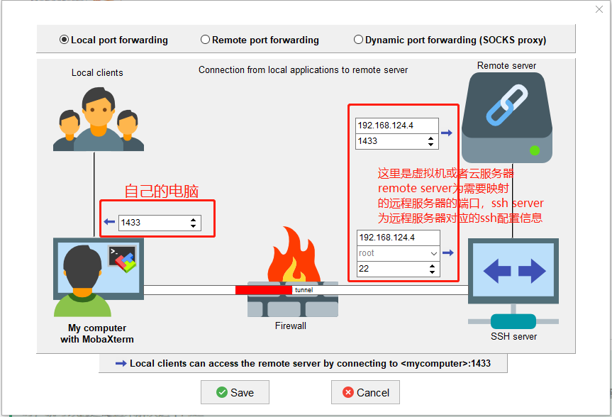
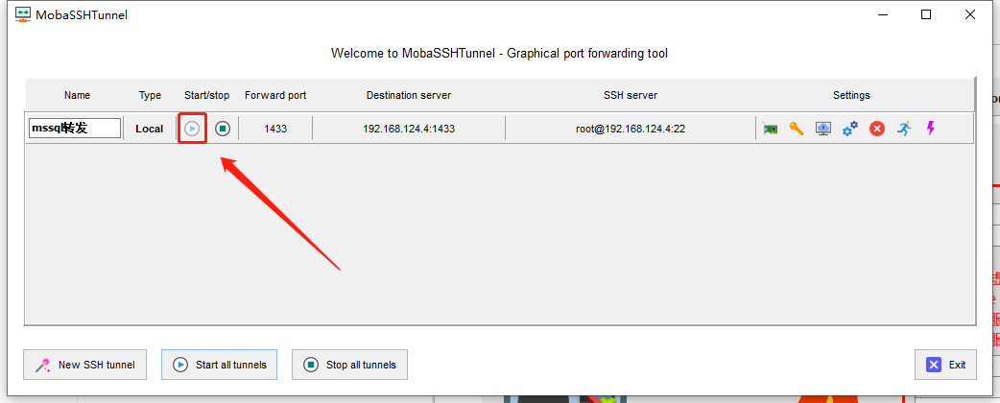

# SSH客户端

* Putty
* OpenSSH
* Xshell
  * 配合Xftp文件上传
* FinalShell
  * 自带文件上传
* MobaXterm(**`推荐`**)
  * 支持多种连接
    * SSH
    * Telnet
    * RDP
    * SFTP
    * WSL
  * 自带文件上传
* 宝塔终端
  * 自带文件上传

## MobaXterm端口转发（隧道）

> 隧道的作用就是将内网资源映射到公网，或者将内网资源通过跳板机的方式提供给其他主机访问
>
> 许多公司有n多服务器，这些服务器都只能通过跳板机或者指定物理主机才能连接，当我们的线上环境出现bug，想要通过本地注解直连并访问服务器资源时，就可以通过隧道来解决这个问题

### # 如下需求：我需要通过隧道将虚拟机里面的sqlserver的1433端口映射到我本地，这样我局域网内的其他主机可以通过我本地物理机访问到虚拟机里面的sqlserver服务，具体做法如下：

* 选择主界面`Tunneling`，然后新建`Local port forwarding`，然后如下配置：

* 然后点击启动即可访问

