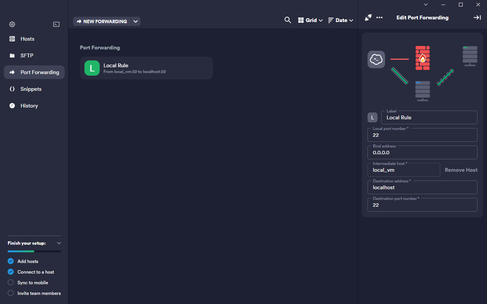

# SSH客户端

* Putty
* OpenSSH
* Xshell (需破解)
  * 配合Xftp文件上传
* FinalShell
  * 自带文件上传
* MobaXterm(**`推荐`**)
  * 支持多种连接
    * SSH
    * Telnet
    * RDP
    * SFTP
    * WSL
  * 自带文件上传
* 宝塔终端
  * 自带文件上传
* termius


## MobaXterm端口转发（隧道）

> 隧道的作用就是将内网资源映射到公网，或者将内网资源通过跳板机的方式提供给其他主机访问
>
> 许多公司有n多服务器，这些服务器都只能通过跳板机或者指定物理主机才能连接，当我们的线上环境出现bug，想要通过本地注解直连并访问服务器资源时，就可以通过隧道来解决这个问题

### # 如下需求：我需要通过隧道将虚拟机里面的sqlserver的1433端口映射到我本地，这样我局域网内的其他主机可以通过我本地物理机访问到虚拟机里面的sqlserver服务，具体做法如下：

* 选择主界面`Tunneling`，然后新建`Local port forwarding`，然后如下配置：


* 然后点击启动即可访问


## 通过ssh命令实现端口转发

* -N 参数表示不执行远程命令，仅建立SSH连接。
* -L 参数表示本地端口转发。它允许你将本地计算机上的一个端口（例如：localhost:8080）映射到远程服务器的另一个地址和端口上（例如：example.com:80），从而让本地计算机可以通过localhost:8080访问example.com:80。
* 0.0.0.0:22 允许所有网段访问22端口，映射到本地22端口，局域网可以访问22端口
* root@192.168.56.101 表示将192.168.56.101的主机的22端口，root用户映射到本地

```sh
ssh -N -L 0.0.0.0:22:localhost:22 root@192.168.56.101
```

## Termius（需破解）

### 隧道（端口转发）

> 将远程端口映射到本地，让局域网的其他主机可以直接连接服务器，下图可以让局域网其他主机访问我本地22端口实现远程登录我虚拟机里面的服务器

* Local port number和Bind address为本地的地址和端口，一般用0.0.0.0和端口为指定端口，允许所有网段访问此端口
* Destination address和Destionation port number为本地ip和对应服务器的端口，一般用localhost加上对应的端口


