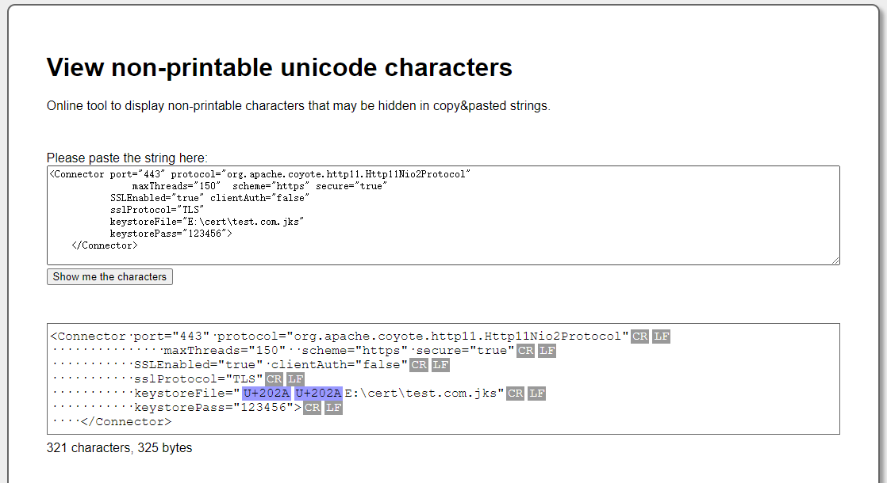

# Tomcat配置https (Windows)

* 创建证书，分别创建`test.com`和`dev.com`两个域名的证书

```shell
keytool -genkey -alias domainname -keyalg RSA -keysize 2048 -keystore filename.jks
keytool -genkey -alias test.com -keyalg RSA -keysize 2048 -keystore test.com.jks

keytool -genkeypair -alias test.com -keypass 123456 -keyalg RSA -keysize 1024 -validity 365 -keystore E:\cert\test.com.jks -storepass 123456
输入密钥库口令:
再次输入新口令:
您的名字与姓氏是什么?
  [Unknown]:  jonny
您的组织单位名称是什么?
  [Unknown]:  jonny
您的组织名称是什么?
  [Unknown]:  jonny
您所在的城市或区域名称是什么?
  [Unknown]:  cq
您所在的省/市/自治区名称是什么?
  [Unknown]:  cq
该单位的双字母国家/地区代码是什么?
  [Unknown]:  cn
CN=jonny, OU=jonny, O=jonny, L=cq, ST=cq, C=cn是否正确?
  [否]:  y

输入 <test.com> 的密钥口令
        (如果和密钥库口令相同, 按回车):
再次输入新口令:
  
  
keytool -genkeypair -alias dev.com -keypass 123456 -keyalg RSA -keysize 1024 -validity 365 -keystore E:\cert\dev.com.jks -storepass 123456
您的名字与姓氏是什么?
  [Unknown]:  kevin
您的组织单位名称是什么?
  [Unknown]:  kevin
您的组织名称是什么?
  [Unknown]:  kevin
您所在的城市或区域名称是什么?
  [Unknown]:  cq
您所在的省/市/自治区名称是什么?
  [Unknown]:  cq
该单位的双字母国家/地区代码是什么?
  [Unknown]:  cn
CN=kevin, OU=kevin, O=kevin, L=cq, ST=cq, C=cn是否正确?
  [否]:  y
  
# 申请证书，下载证书文件 full_chain.pem 和 private.key
http://freeSSL.org
  
# 使用 openssl 控制台将 full_chain.pem 和 private.key 生成 pfx 文件 
pkcs12 -export -out tomcat.pfx -in D:\full_chain.pem -inkey D:\private.key

# pfx转jks
keytool -importkeystore -srckeystore tomcat.pfx -destkeystore tomcat.jks -srcstoretype PKCS12 -deststoretype JKS
  
# 查看jks信息
keytool -v -list -keystore test.com.jks
```

> Http11Nio2Protocol协议 的端口443

```
‪E:/cert/dev.test.com.jks
‪E:/cert/test.com.jks


```

# 配置证书

## 1. tomcat/conf/server.xml

> 默认为8843端口默认协议为`org.apache.coyote.http11.Http11NioProtocol`，可以改成443，协议用`org.apache.coyote.http11.Http11Nio2Protocol`

```xml
<?xml version='1.0' encoding='utf-8'?>
<!--
  Licensed to the Apache Software Foundation (ASF) under one or more
  contributor license agreements.  See the NOTICE file distributed with
  this work for additional information regarding copyright ownership.
  The ASF licenses this file to You under the Apache License, Version 2.0
  (the "License"); you may not use this file except in compliance with
  the License.  You may obtain a copy of the License at

      http://www.apache.org/licenses/LICENSE-2.0

  Unless required by applicable law or agreed to in writing, software
  distributed under the License is distributed on an "AS IS" BASIS,
  WITHOUT WARRANTIES OR CONDITIONS OF ANY KIND, either express or implied.
  See the License for the specific language governing permissions and
  limitations under the License.
-->
<!-- Note:  A "Server" is not itself a "Container", so you may not
     define subcomponents such as "Valves" at this level.
     Documentation at /docs/config/server.html
 -->
<Server port="8005" shutdown="SHUTDOWN">
  <Listener className="org.apache.catalina.startup.VersionLoggerListener" />
  <!-- Security listener. Documentation at /docs/config/listeners.html
  <Listener className="org.apache.catalina.security.SecurityListener" />
  -->
  <!--APR library loader. Documentation at /docs/apr.html -->
  <Listener className="org.apache.catalina.core.AprLifecycleListener" SSLEngine="on" />
  <!-- Prevent memory leaks due to use of particular java/javax APIs-->
  <Listener className="org.apache.catalina.core.JreMemoryLeakPreventionListener" />
  <Listener className="org.apache.catalina.mbeans.GlobalResourcesLifecycleListener" />
  <Listener className="org.apache.catalina.core.ThreadLocalLeakPreventionListener" />

  <!-- Global JNDI resources
       Documentation at /docs/jndi-resources-howto.html
  -->
  <GlobalNamingResources>
    <!-- Editable user database that can also be used by
         UserDatabaseRealm to authenticate users
    -->
    <Resource name="UserDatabase" auth="Container"
              type="org.apache.catalina.UserDatabase"
              description="User database that can be updated and saved"
              factory="org.apache.catalina.users.MemoryUserDatabaseFactory"
              pathname="conf/tomcat-users.xml" />
  </GlobalNamingResources>

  <!-- A "Service" is a collection of one or more "Connectors" that share
       a single "Container" Note:  A "Service" is not itself a "Container",
       so you may not define subcomponents such as "Valves" at this level.
       Documentation at /docs/config/service.html
   -->
  <Service name="Catalina">

    <!--The connectors can use a shared executor, you can define one or more named thread pools-->
    <!--
    <Executor name="tomcatThreadPool" namePrefix="catalina-exec-"
        maxThreads="150" minSpareThreads="4"/>
    -->


    <!-- A "Connector" represents an endpoint by which requests are received
         and responses are returned. Documentation at :
         Java HTTP Connector: /docs/config/http.html (blocking & non-blocking)
         Java AJP  Connector: /docs/config/ajp.html
         APR (HTTP/AJP) Connector: /docs/apr.html
         Define a non-SSL/TLS HTTP/1.1 Connector on port 8080
    -->
    <Connector port="80" protocol="HTTP/1.1"
               connectionTimeout="20000"
               redirectPort="443" URIEncoding="UTF-8" />
    <!-- A "Connector" using the shared thread pool-->
    <!--
    <Connector executor="tomcatThreadPool"
               port="8080" protocol="HTTP/1.1"
               connectionTimeout="20000"
               redirectPort="8443" />
    -->
    <!-- Define a SSL/TLS HTTP/1.1 Connector on port 8443
         This connector uses the NIO implementation that requires the JSSE
         style configuration. When using the APR/native implementation, the
         OpenSSL style configuration is required as described in the APR/native
         documentation -->
    <!--
    <Connector port="8443" protocol="org.apache.coyote.http11.Http11NioProtocol"
               maxThreads="150" SSLEnabled="true" scheme="https" secure="true"
               clientAuth="false" sslProtocol="TLS" />
    -->
	
	<Connector port="443" protocol="org.apache.coyote.http11.Http11Nio2Protocol"
               maxThreads="150" scheme="https" secure="true"
           SSLEnabled="true" clientAuth="false"
           sslProtocol="TLS"
           keystoreFile="e:\cert\test.com.jks"
           keystorePass="123456">
    </Connector>

    <!-- Define an AJP 1.3 Connector on port 8009 -->
    <Connector port="8009" protocol="AJP/1.3" redirectPort="443" />


    <!-- An Engine represents the entry point (within Catalina) that processes
         every request.  The Engine implementation for Tomcat stand alone
         analyzes the HTTP headers included with the request, and passes them
         on to the appropriate Host (virtual host).
         Documentation at /docs/config/engine.html -->

    <!-- You should set jvmRoute to support load-balancing via AJP ie :
    <Engine name="Catalina" defaultHost="localhost" jvmRoute="jvm1">
    -->
    <Engine name="Catalina" defaultHost="test.com">

      <!--For clustering, please take a look at documentation at:
          /docs/cluster-howto.html  (simple how to)
          /docs/config/cluster.html (reference documentation) -->
      <!--
      <Cluster className="org.apache.catalina.ha.tcp.SimpleTcpCluster"/>
      -->

      <!-- Use the LockOutRealm to prevent attempts to guess user passwords
           via a brute-force attack -->
      <Realm className="org.apache.catalina.realm.LockOutRealm">
        <!-- This Realm uses the UserDatabase configured in the global JNDI
             resources under the key "UserDatabase".  Any edits
             that are performed against this UserDatabase are immediately
             available for use by the Realm.  -->
        <Realm className="org.apache.catalina.realm.UserDatabaseRealm"
               resourceName="UserDatabase"/>
      </Realm>

      <Host name="localhost"  appBase="webapps"
            unpackWARs="true" autoDeploy="true">

        <!-- SingleSignOn valve, share authentication between web applications
             Documentation at: /docs/config/valve.html -->
        <!--
        <Valve className="org.apache.catalina.authenticator.SingleSignOn" />
        -->

        <!-- Access log processes all example.
             Documentation at: /docs/config/valve.html
             Note: The pattern used is equivalent to using pattern="common" -->
        <Valve className="org.apache.catalina.valves.AccessLogValve" directory="logs"
               prefix="localhost_access_log" suffix=".txt"
               pattern="%h %l %u %t &quot;%r&quot; %s %b" />

      </Host>
    </Engine>
  </Service>
</Server>
```

## 2. 强制使用https访问

> 修改`conf/web.xml`，访问http的80端口默认强制转发到https的443端口

```xml
<welcome-file-list>
    <welcome-file>index.html</welcome-file>
    <welcome-file>index.htm</welcome-file>
    <welcome-file>index.jsp</welcome-file>
</welcome-file-list>
<login-config>
    <auth-method>CLIENT-CERT</auth-method> 
    <realm-name>Client Cert Users-only Area</realm-name> 
</login-config> 
<security-constraint> 
    <web-resource-collection > 
        <web-resource-name >SSL</web-resource-name> 
        <url-pattern>/*</url-pattern> 
    </web-resource-collection> 
    <user-data-constraint> 
        <transport-guarantee>CONFIDENTIAL</transport-guarantee> 
    </user-data-constraint> 
</security-constraint>
```

## 3. 修改本地`hosts`，通过域名访问

```properties
127.0.0.1 test.com
127.0.0.1 dev.com
```

## 4.刷新缓存

```bash
# 刷新DNS缓存
ipconfig /flushdns

# 查看DNS缓存
ipconfig /displaydns
```

## 5 .测试

> 访问test.com的时候，默认跳转到了https://test.com了


# 多域名证书配置

* 如果配置了 `certificateVerification="none"`可以不用配置`SSLCACertificateChainFile="e:\cert\test.com.jks"`，都不配置会报错
* 多域名时必须指定一个默认的`defaultSSLHostConfigName`域名
* 多域名用同一个端口443，经测试没配置出来就放弃了，推荐用nginx去做配置
* 不同tomcat版本有些属性参数都不一样

## 1. 通过不同端口映射

> 修改`conf/server.xml`

* test.com --> https://test.com
* dev.com --> https://dev.com:8443

```xml
<?xml version="1.0" encoding="UTF-8"?>
<!--
  Licensed to the Apache Software Foundation (ASF) under one or more
  contributor license agreements.  See the NOTICE file distributed with
  this work for additional information regarding copyright ownership.
  The ASF licenses this file to You under the Apache License, Version 2.0
  (the "License"); you may not use this file except in compliance with
  the License.  You may obtain a copy of the License at

      http://www.apache.org/licenses/LICENSE-2.0

  Unless required by applicable law or agreed to in writing, software
  distributed under the License is distributed on an "AS IS" BASIS,
  WITHOUT WARRANTIES OR CONDITIONS OF ANY KIND, either express or implied.
  See the License for the specific language governing permissions and
  limitations under the License.
-->
<!-- Note:  A "Server" is not itself a "Container", so you may not
     define subcomponents such as "Valves" at this level.
     Documentation at /docs/config/server.html
 -->
<Server port="8005" shutdown="SHUTDOWN">
  <Listener className="org.apache.catalina.startup.VersionLoggerListener" />
  <!-- Security listener. Documentation at /docs/config/listeners.html
  <Listener className="org.apache.catalina.security.SecurityListener" />
  -->
  <!-- APR library loader. Documentation at /docs/apr.html -->
  <Listener className="org.apache.catalina.core.AprLifecycleListener" SSLEngine="on" />
  <!-- Prevent memory leaks due to use of particular java/javax APIs-->
  <Listener className="org.apache.catalina.core.JreMemoryLeakPreventionListener" />
  <Listener className="org.apache.catalina.mbeans.GlobalResourcesLifecycleListener" />
  <Listener className="org.apache.catalina.core.ThreadLocalLeakPreventionListener" />

  <!-- Global JNDI resources
       Documentation at /docs/jndi-resources-howto.html
  -->
  <GlobalNamingResources>
    <!-- Editable user database that can also be used by
         UserDatabaseRealm to authenticate users
    -->
    <Resource name="UserDatabase" auth="Container"
              type="org.apache.catalina.UserDatabase"
              description="User database that can be updated and saved"
              factory="org.apache.catalina.users.MemoryUserDatabaseFactory"
              pathname="conf/tomcat-users.xml" />
  </GlobalNamingResources>

  <!-- A "Service" is a collection of one or more "Connectors" that share
       a single "Container" Note:  A "Service" is not itself a "Container",
       so you may not define subcomponents such as "Valves" at this level.
       Documentation at /docs/config/service.html
   -->
  <Service name="Catalina">

    <!--The connectors can use a shared executor, you can define one or more named thread pools-->
    <!--
    <Executor name="tomcatThreadPool" namePrefix="catalina-exec-"
        maxThreads="150" minSpareThreads="4"/>
    -->


    <!-- A "Connector" represents an endpoint by which requests are received
         and responses are returned. Documentation at :
         Java HTTP Connector: /docs/config/http.html
         Java AJP  Connector: /docs/config/ajp.html
         APR (HTTP/AJP) Connector: /docs/apr.html
         Define a non-SSL/TLS HTTP/1.1 Connector on port 8080
    -->
    <Connector port="80" protocol="HTTP/1.1"
               connectionTimeout="20000"
               redirectPort="443" />
    <!-- A "Connector" using the shared thread pool-->
    <!--
    <Connector executor="tomcatThreadPool"
               port="8080" protocol="HTTP/1.1"
               connectionTimeout="20000"
               redirectPort="8443" />
    -->
    <!-- Define an SSL/TLS HTTP/1.1 Connector on port 8443
         This connector uses the NIO implementation. The default
         SSLImplementation will depend on the presence of the APR/native
         library and the useOpenSSL attribute of the
         AprLifecycleListener.
         Either JSSE or OpenSSL style configuration may be used regardless of
         the SSLImplementation selected. JSSE style configuration is used below.
    -->
    <!--
    <Connector port="8443" protocol="org.apache.coyote.http11.Http11NioProtocol"
               maxThreads="150" SSLEnabled="true">
        <SSLHostConfig>
            <Certificate certificateKeystoreFile="conf/localhost-rsa.jks"
                         type="RSA" />
        </SSLHostConfig>
    </Connector>
    -->
    <!-- Define an SSL/TLS HTTP/1.1 Connector on port 8443 with HTTP/2
         This connector uses the APR/native implementation which always uses
         OpenSSL for TLS.
         Either JSSE or OpenSSL style configuration may be used. OpenSSL style
         configuration is used below.
    -->
    <!--
    <Connector port="8443" protocol="org.apache.coyote.http11.Http11AprProtocol"
               maxThreads="150" SSLEnabled="true" >
        <UpgradeProtocol className="org.apache.coyote.http2.Http2Protocol" />
        <SSLHostConfig>
            <Certificate certificateKeyFile="conf/localhost-rsa-key.pem"
                         certificateFile="conf/localhost-rsa-cert.pem"
                         certificateChainFile="conf/localhost-rsa-chain.pem"
                         type="RSA" />
        </SSLHostConfig>
    </Connector>
    -->
	<Connector port="443" protocol="org.apache.coyote.http11.Http11AprProtocol"
           maxThreads="150" compression="on" URIEncoding="UTF-8"
           scheme="https"
           SSLEnabled="true"
           secure="true" defaultSSLHostConfigName="test.com">
        <UpgradeProtocol className="org.apache.coyote.http2.Http2Protocol" />
        <!--域名1证书-->
		<SSLHostConfig hostName="test.com" certificateVerification="none" sslProtocol="TLS">
			<Certificate certificateKeystoreFile="e:\cert\test.com.jks"
				 certificateKeystorePassword="123456"
				 type="RSA"/>
		</SSLHostConfig>

    </Connector>
	<Connector port="8443" protocol="org.apache.coyote.http11.Http11AprProtocol"
           maxThreads="150" compression="on" URIEncoding="UTF-8"
           scheme="https"
           SSLEnabled="true"
           secure="true" defaultSSLHostConfigName="dev.com">
        <UpgradeProtocol className="org.apache.coyote.http2.Http2Protocol" />

		<!--域名2证书-->
		<SSLHostConfig hostName="dev.com" certificateVerification="none" sslProtocol="TLS">
			<Certificate certificateKeystoreFile="e:\cert\dev.com.jks"
				 certificateKeystorePassword="123456"
				 type="RSA"/>
		</SSLHostConfig>
    </Connector>

    <!-- Define an AJP 1.3 Connector on port 8009 -->
    <!--
    <Connector protocol="AJP/1.3"
               address="::1"
               port="8009"
               redirectPort="8443" />
    -->

    <!-- An Engine represents the entry point (within Catalina) that processes
         every request.  The Engine implementation for Tomcat stand alone
         analyzes the HTTP headers included with the request, and passes them
         on to the appropriate Host (virtual host).
         Documentation at /docs/config/engine.html -->

    <!-- You should set jvmRoute to support load-balancing via AJP ie :
    <Engine name="Catalina" defaultHost="localhost" jvmRoute="jvm1">
    -->
    <Engine name="Catalina" defaultHost="test.com">

      <!--For clustering, please take a look at documentation at:
          /docs/cluster-howto.html  (simple how to)
          /docs/config/cluster.html (reference documentation) -->
      <!--
      <Cluster className="org.apache.catalina.ha.tcp.SimpleTcpCluster"/>
      -->

      <!-- Use the LockOutRealm to prevent attempts to guess user passwords
           via a brute-force attack -->
      <Realm className="org.apache.catalina.realm.LockOutRealm">
        <!-- This Realm uses the UserDatabase configured in the global JNDI
             resources under the key "UserDatabase".  Any edits
             that are performed against this UserDatabase are immediately
             available for use by the Realm.  -->
        <Realm className="org.apache.catalina.realm.UserDatabaseRealm"
               resourceName="UserDatabase"/>
      </Realm>

      <!-- <Host name="localhost"  appBase="webapps"
            unpackWARs="true" autoDeploy="true"> -->

        <!-- SingleSignOn valve, share authentication between web applications
             Documentation at: /docs/config/valve.html -->
        <!--
        <Valve className="org.apache.catalina.authenticator.SingleSignOn" />
        -->

        <!-- Access log processes all example.
             Documentation at: /docs/config/valve.html
             Note: The pattern used is equivalent to using pattern="common" -->
        <!-- <Valve className="org.apache.catalina.valves.AccessLogValve" directory="logs"
               prefix="localhost_access_log" suffix=".txt"
               pattern="%h %l %u %t &quot;%r&quot; %s %b" />

      </Host> -->
	  
	  
	  <!--域名1访问-->
		<Host name="test.com" appBase="webapps" unpackWARs="true" autoDeploy="true">
			  
			  <Alias>test.com</Alias>
			  
			  <!--配置路径访问-->
			<Context path="" docBase="ROOT"></Context>
			<Valve className="org.apache.catalina.valves.AccessLogValve" directory="logs" 
				   prefix="localhost_access_log" suffix=".txt" 
				   pattern="%h %l %u %t &quot;%r&quot; %s %b" />
		</Host>
		<!--域名2访问-->
		<Host name="dev.com" appBase="webapps" unpackWARs="true" autoDeploy="true">
			  	  
			  <Alias>dev.com</Alias>
				  
			  <!--配置路径访问-->
			<Context path="" docBase="test"></Context>
			<Valve className="org.apache.catalina.valves.AccessLogValve" directory="logs"
				   prefix="localhost_access_log" suffix=".txt"
				   pattern="%h %l %u %t &quot;%r&quot; %s %b" />
		</Host>
	  
    </Engine>
  </Service>
</Server>
```


```xml
# 1.配置了APR的 协议名更改为 "org.apache.coyote.http11.Http11AprProtocol"
# 2.使用HTTP 2.0 需要在Connector添加子节点
  <UpgradeProtocol className="org.apache.coyote.http2.Http2Protocol" />
# tomcat 9.0 已存在默认配置
  找到Connector协议为`org.apache.coyote.http11.Http11AprProtocol`
  取消注释，相应修改即可
```


# 问题

> tomcat配置了`jks`证书文件，启动报错，字符问题，最终手敲一遍问题解决

```java
24-Jul-2021 22:19:00.867 严重 [main] org.apache.tomcat.util.net.jsse.JSSESocketFactory.getStore Failed to load keystore type JKS with path ??E:\cert\test.com.jks due to Illegal character in scheme name at index 0: ??E:\cert\test.com.jks
 java.lang.IllegalArgumentException: Illegal character in scheme name at index 0: ??E:\cert\test.com.jks
	at java.net.URI.create(URI.java:852)
	at java.net.URI.resolve(URI.java:1036)
	at org.apache.tomcat.util.file.ConfigFileLoader.getInputStream(ConfigFileLoader.java:88)
	at org.apache.tomcat.util.net.jsse.JSSESocketFactory.getStore(JSSESocketFactory.java:442)
	at org.apache.tomcat.util.net.jsse.JSSESocketFactory.getKeystore(JSSESocketFactory.java:353)
	at org.apache.tomcat.util.net.jsse.JSSESocketFactory.getKeyManagers(JSSESocketFactory.java:606)
	at org.apache.tomcat.util.net.jsse.JSSESocketFactory.getKeyManagers(JSSESocketFactory.java:546)
	at org.apache.tomcat.util.net.NioEndpoint.bind(NioEndpoint.java:370)
	at org.apache.tomcat.util.net.AbstractEndpoint.init(AbstractEndpoint.java:810)
	at org.apache.coyote.AbstractProtocol.init(AbstractProtocol.java:476)
	at org.apache.coyote.http11.AbstractHttp11JsseProtocol.init(AbstractHttp11JsseProtocol.java:120)
	at org.apache.catalina.connector.Connector.initInternal(Connector.java:960)
	at org.apache.catalina.util.LifecycleBase.init(LifecycleBase.java:102)
	at org.apache.catalina.core.StandardService.initInternal(StandardService.java:568)
	at org.apache.catalina.util.LifecycleBase.init(LifecycleBase.java:102)
	at org.apache.catalina.core.StandardServer.initInternal(StandardServer.java:871)
	at org.apache.catalina.util.LifecycleBase.init(LifecycleBase.java:102)
	at org.apache.catalina.startup.Catalina.load(Catalina.java:581)
	at org.apache.catalina.startup.Catalina.load(Catalina.java:604)
	at sun.reflect.NativeMethodAccessorImpl.invoke0(Native Method)
	at sun.reflect.NativeMethodAccessorImpl.invoke(NativeMethodAccessorImpl.java:62)
	at sun.reflect.DelegatingMethodAccessorImpl.invoke(DelegatingMethodAccessorImpl.java:43)
	at java.lang.reflect.Method.invoke(Method.java:498)
	at org.apache.catalina.startup.Bootstrap.load(Bootstrap.java:310)
	at org.apache.catalina.startup.Bootstrap.main(Bootstrap.java:484)
Caused by: java.net.URISyntaxException: Illegal character in scheme name at index 0: ??E:\cert\test.com.jks
	at java.net.URI$Parser.fail(URI.java:2848)
	at java.net.URI$Parser.checkChars(URI.java:3021)
	at java.net.URI$Parser.checkChar(URI.java:3031)
	at java.net.URI$Parser.parse(URI.java:3047)
	at java.net.URI.<init>(URI.java:588)
	at java.net.URI.create(URI.java:850)
	... 24 more
```

# [非法字符检测](https://www.soscisurvey.de/tools/view-chars.php)



# [证书安装](https://cloud.tencent.com/document/product/400/4143#4.-tomcat-.E8.AF.81.E4.B9.A6.E9.83.A8.E7.BD.B2)

# 注意！！！

* `tomcat8.5`之后，在`Connector`元素中配置相关SSL属性已被废弃，应该使用`SSLHostConfig` and `Certificate`；端口`8443`可以直接改为`https`默认的`443`端口；`certificateKeystoreFile`需要设置自己的`keystore`文件路径。
* 注意两个`Port="443"`的`Connector`配置，最后面的`address`参数是关键，如果不加`address`，那么Tomcat将会报错，说443端口已被使用。

* `SSLHostConfig`的`caCertificateFile`和`caCertificatePath`属性仅限`OpenSSL`，具体参考末尾的`参考8`


# 参考文档

[参考1](https://hemingsheng.cn/2020/12/12/tomcat-%E9%85%8D%E7%BD%AE%E5%A4%9A%E5%9F%9F%E5%90%8D%E8%AE%BF%E9%97%AE%E8%AE%BF%E9%97%AE%E5%90%8C%E4%B8%80%E4%B8%AA%E7%BD%91%E7%AB%99%E7%9A%84%E7%9B%B8%E5%90%8C%E6%88%96%E8%80%85%E4%B8%8D%E5%90%8C%E9%A1%B9%E7%9B%AE/)

[参考2](http://soiiy.com/java/13631.html)

[参考3](https://blog.csdn.net/HaHa_Sir/article/details/109720275)

[参考4]()

[参考5](https://www.codeleading.com/article/93713925707/)

[参考6](https://blog.csdn.net/zhou_hai_feng/article/details/108871789)

[参考7（最有用）](https://blog.csdn.net/baidu_18607183/article/details/51983439)

[参考8(tomcat9)](https://tomcat.apache.org/tomcat-9.0-doc/config/http.html)

[tomcat9](https://tomcat.apache.org/tomcat-9.0-doc/ssl-howto.html)

[tomcat8](https://tomcat.apache.org/tomcat-8.0-doc/ssl-howto.html)