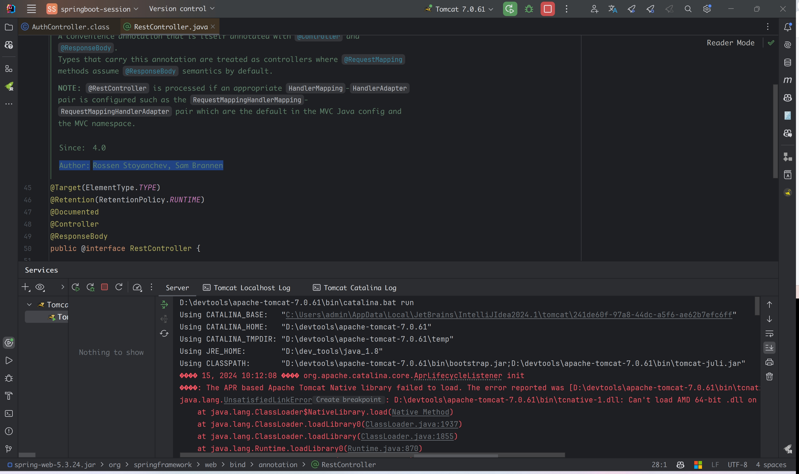
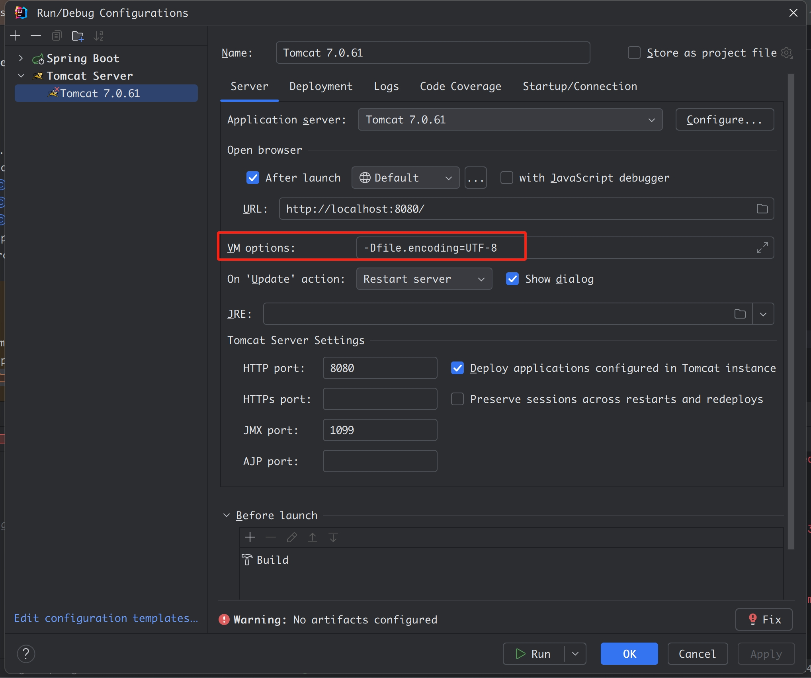

## IDEA Tomcat环境配置(CATALINA_BASE、乱码encoding)

### 基础配置

> 在idea中启动tomcat，默认会在用户目录生成一堆临时运行目录，因为他读的`CATALINA_BASE`为用户目录



#### 如何处理

* 在tomcat配置里面的`Stratup/Connection`里面分别为`Run`和`Debug`添加`CATALINA_BASE`变量

  ```sh
  CATALINA_BASE D:\devtools\apache-tomcat-7.0.61
  ```

#### 效果


### 控制台日志乱码

> Settings》Editor》General》Console》将Default Encoding设置为UTF-8


同时在tomcat VM Options中添加配置: `-Dfile.encoding=UTF-8`

