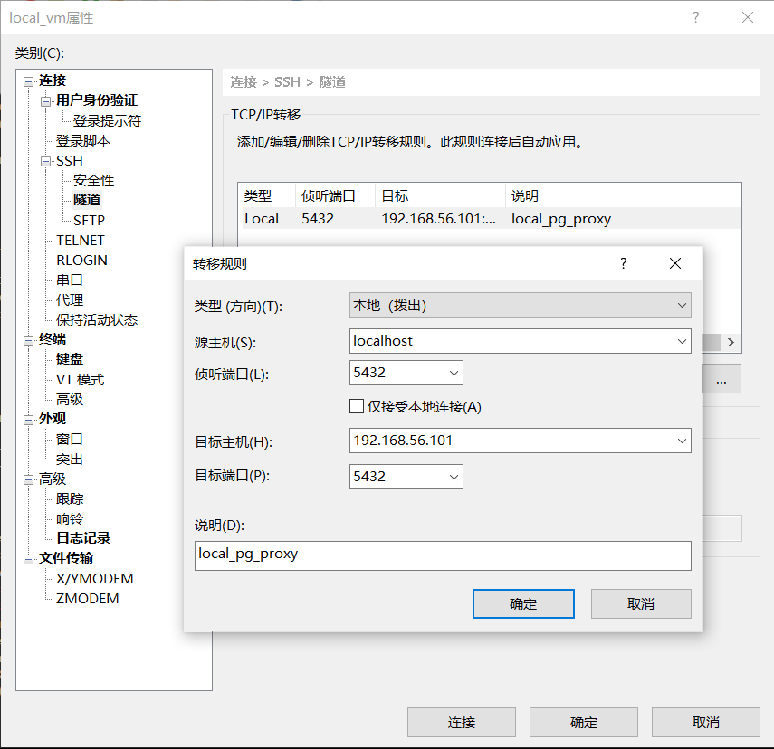

# 隧道技术

> 场景：假如你在自己的虚拟机中安装了一个数据库，但是虚拟机和物理主机之间是`host模式`【**仅主机模式**】，这种模式的网络只有虚拟机所在的物理主机可以直连，局域网内其他主机是无法访问你的虚拟机的，若想要将虚拟机的数据库提供给局域网主机访问，这里就需要用到xshell隧道技术进行端口转发了。

## 配置

* 类型：拨出
* `源主机`就是本机ip，侦听端口可以任意指定
* `目标主机`是虚拟机ip地址，目标端口是你需要侦听的端口，比如postgres数据库的端口是`5432`，这里就填`5432`
* 配置好后需要关闭窗口重新连接一次
* 而且连接后xshell窗口不能关闭，如果公司有做限制【比如WAF】的话，普通账号是无法配置的，需要`root`用户




## 查看端口

> 如果能找到结果说明端口映射成功

```
C:\Users\Administrator>netstat -ano | findstr 5432
  TCP    0.0.0.0:5432           0.0.0.0:0              LISTENING       26200
  TCP    192.168.2.222:5432     10.168.12.178:51076    ESTABLISHED     26200
  TCP    192.168.2.222:5432     10.168.12.178:51077    ESTABLISHED     26200
  TCP    192.168.56.1:58676     192.168.56.101:5432    ESTABLISHED     22400
  TCP    192.168.56.1:65300     192.168.56.101:5432    ESTABLISHED     22400
  TCP    192.168.56.1:65301     192.168.56.101:5432    ESTABLISHED     22400
  TCP    [::]:5432              [::]:0                 LISTENING       26200
```

接下来就可以通过工具连接物理机ip访问虚拟机【也就是配置的**`源主机ip和端口`**】的端口了

